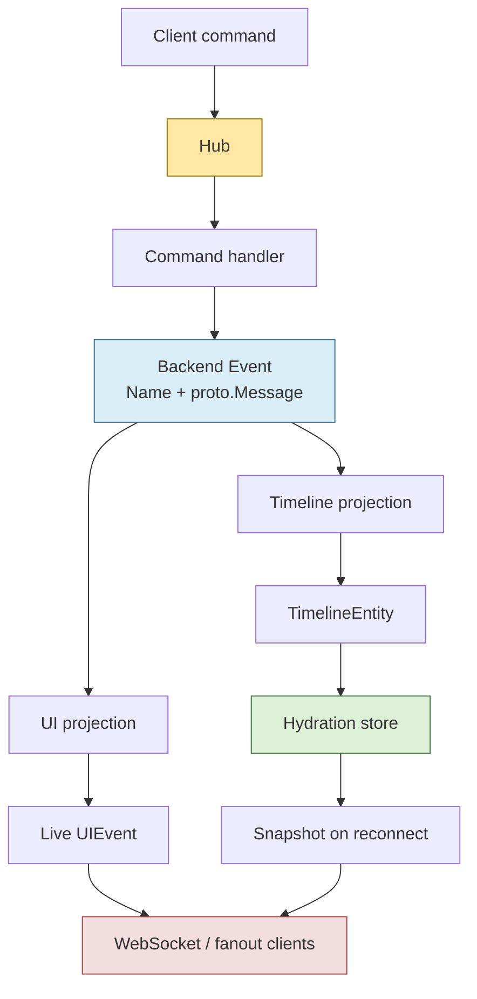

# sessionstream

`sessionstream` is a Go framework for building session-scoped, event-driven applications where commands produce canonical backend events, projections derive live UI and durable timeline state, and clients can reconnect through hydrated snapshots.

It is the reusable framework layer behind applications such as Pinocchio web chat and CoinVault's inventory assistant. Those applications own their product behavior. `sessionstream` owns the substrate: command routing, event publication, schema registration, projection, persistence hooks, fanout, and transport contracts.

## Why sessionstream exists

Many interactive backend applications have the same shape:

1. A client sends a command for a session.
2. The backend does work over time.
3. The backend emits intermediate and final events.
4. The UI updates live while work is happening.
5. The timeline must survive reloads, reconnects, and process restarts.

Without a shared substrate, every application reinvents the same machinery: command dispatch, event ordering, fanout, projection, snapshotting, websocket hydration, and error handling. `sessionstream` packages those responsibilities into a reusable framework while leaving application-specific decisions in downstream repositories.

The central idea is simple: handlers publish events instead of returning UI state. Once work is described as canonical backend events, different projections can derive different views of the same history.

## Core model



The `Hub` receives a command for a `SessionId` and routes it to a registered handler. The handler receives an `EventPublisher`; it publishes canonical backend events as work starts, progresses, completes, or fails. UI projections turn those backend events into live client-facing `UIEvent` values. Timeline projections turn the same backend events into durable `TimelineEntity` values that hydration stores can persist and reload.

This separation is the design's most important property. Backend events describe what happened. UI projections decide what live clients should see now. Timeline projections decide what durable state should exist after the event. A client that reconnects later receives a snapshot of that durable state before future live events.

## When to use it

Use `sessionstream` when your application has one or more of these traits:

- Long-running or streaming backend work.
- Session-scoped state.
- Live UI updates derived from backend events.
- Reconnect, reload, or restart requirements.
- Timeline state that should be persisted and hydrated.
- Multiple consumers that need different views of the same event stream.

Good fits include chat applications, agent UIs, operator dashboards, workflow consoles, lab/simulation environments, and rich tool-driven assistants.

Do not use `sessionstream` for a simple request/response CRUD service with no streaming work, no event-derived UI state, and no hydration requirement. The framework is useful when the command/event/projection split buys you clarity.

## Quick start

Install the module:

```bash
go get github.com/go-go-golems/sessionstream
```

The smallest useful application has four pieces:

1. A schema registry that names concrete protobuf payloads.
2. A hub.
3. A command handler that publishes backend events.
4. One or more projections that derive UI or timeline state.

The chat demo under `examples/chatdemo` is the best runnable reference. It registers typed protobuf schemas, installs handlers and projections, streams fake inference chunks, and exposes snapshots:

```go
reg := sessionstream.NewSchemaRegistry()
if err := chatdemo.RegisterSchemas(reg); err != nil {
    return err
}

hub, err := sessionstream.NewHub(
    sessionstream.WithSchemaRegistry(reg),
)
if err != nil {
    return err
}

engine := chatdemo.NewEngine()
if err := chatdemo.Install(hub, engine); err != nil {
    return err
}

service, err := chatdemo.NewService(hub, engine)
if err != nil {
    return err
}

if err := service.SubmitPrompt(ctx, "session-1", "Explain ordinals"); err != nil {
    return err
}

snapshot, err := service.Snapshot(ctx, "session-1")
```

The interesting part is inside the handler. It does not return a `ChatMessage` or a UI state object. It publishes events:

```go
func (e *Engine) handleStartInference(
    ctx context.Context,
    cmd sessionstream.Command,
    _ *sessionstream.Session,
    pub sessionstream.EventPublisher,
) error {
    payload := cmd.Payload.(*chatdemov1.StartInferenceCommand)

    return pub.Publish(ctx, sessionstream.Event{
        Name:      EventUserMessageAccepted,
        SessionId: cmd.SessionId,
        Payload: &chatdemov1.UserMessageAcceptedEvent{
            Role:    "user",
            Content: payload.GetPrompt(),
        },
    })
}
```

A projection then decides how that event should appear to clients or in durable timeline state:

```go
func uiProjection(
    ctx context.Context,
    ev sessionstream.Event,
    sess *sessionstream.Session,
    view sessionstream.TimelineView,
) ([]sessionstream.UIEvent, error) {
    switch ev.Name {
    case EventUserMessageAccepted:
        return []sessionstream.UIEvent{{
            Name:    UIMessageAccepted,
            Payload: ev.Payload,
        }}, nil
    default:
        return nil, nil
    }
}
```

Read the full example in [`examples/chatdemo/chat.go`](examples/chatdemo/chat.go), then inspect the tests in [`examples/chatdemo/chat_test.go`](examples/chatdemo/chat_test.go) to see the expected event and snapshot behavior.

## Concepts

### Session

A session is the unit of routing, state, fanout, hydration, and cursor tracking. Commands and events carry a `SessionId`. A reconnecting client asks for the state of a session, not for global application state.

### Command

A command is an external request to do work. Commands are validated through the `SchemaRegistry` and routed by the `Hub` to a registered `CommandHandler`.

### Backend event

A backend event is the canonical record of something that happened. Handlers publish backend events. Projections consume backend events. Durable stores can append backend events for replay or cursor recovery.

### UI event

A UI event is live, client-facing projected state. It is not the source of truth. It is what a websocket client or fanout subscriber should receive now because a backend event happened.

### Timeline entity

A timeline entity is durable projected state. Timeline projections emit entities, and hydration stores persist them so snapshots can be rebuilt after reconnects or restarts.

### Projection

A projection translates backend events into a particular view. UI projections produce live UI events. Timeline projections produce durable entities. Keeping these separate prevents handlers from knowing too much about frontend rendering or persistence.

### Hydration

Hydration is the snapshot path. A reconnecting client receives the current timeline state first, then future live events. This is what lets clients recover from reloads without asking handlers to replay product logic.

### Ordinal

Ordinals define event order. The local publisher assigns monotonically increasing ordinals per session; bus-backed configurations can derive ordinals from stream IDs. Snapshots and entities carry ordinal information so clients can reason about ordering and freshness.

## Schema contract

`sessionstream` is protobuf-first. Payloads registered with the `SchemaRegistry` must be concrete protobuf messages:

```go
reg.RegisterEvent("ToolCallUpdated", &toolv1.ToolCallUpdate{})
reg.RegisterUIEvent("ToolCallRendered", &toolv1.ToolCallUpdate{})
reg.RegisterTimelineEntity("ToolCall", &toolv1.ToolCallEntity{})
```

Do not register top-level `google.protobuf.Struct` payloads:

```go
// Rejected by sessionstream-lint.
reg.RegisterEvent("ToolCallUpdated", &structpb.Struct{})
```

A top-level `Struct` is an arbitrary JSON object. It hides the contract from Go, from generated frontend code, from hydration, and from reviewers. `google.protobuf.Struct` can still appear inside a concrete message when a specific field is intentionally open-ended metadata. The top-level command, event, UI event, or timeline entity should still be named and typed.

Run the schema policy checker with:

```bash
make schema-vet
```

For the operational playbook, see [`pkg/doc/playbooks/01-sessionstream-schema-vet.md`](pkg/doc/playbooks/01-sessionstream-schema-vet.md). The files under `pkg/doc` are embedded by `github.com/go-go-golems/sessionstream/pkg/doc` so downstream CLIs can load them into a Glazed help system.

## WebSocket and hydration contract

The websocket transport uses protobuf-defined frames from [`proto/sessionstream/v1/transport.proto`](proto/sessionstream/v1/transport.proto). The wire format is protobuf JSON so browser clients can consume ordinary websocket text messages while still following a typed contract.

The reconnect contract is snapshot-before-live:

1. A client subscribes to a session.
2. The server sends the current snapshot.
3. The server sends future live UI events.

The important fields are:

- `Snapshot.snapshotOrdinal`, the highest timeline ordinal represented by the snapshot.
- `SnapshotEntity.createdOrdinal`, the ordinal that created the entity.
- `SnapshotEntity.lastEventOrdinal`, the latest event ordinal that updated the entity.
- `UiEventFrame.eventOrdinal`, the backend event ordinal that produced the live UI event.

Browser clients should treat `uint64` ordinals as protobuf JSON strings. Do not coerce them through JavaScript `number` if precision matters.

## Repository layout

```text
pkg/sessionstream/              Core framework APIs: hub, commands, events, projections, hydration interfaces
pkg/sessionstream/hydration/    Hydration store implementations
pkg/sessionstream/transport/    Transport adapters, including websocket support
pkg/analysis/                   Go analysis / vet tooling
pkg/doc/                        Embedded Glazed help sections for downstream CLIs
cmd/sessionstream-lint/         Schema policy vettool
cmd/sessionstream-systemlab/    Interactive/lab reference application
examples/chatdemo/              Small chat-style reference app
proto/sessionstream/v1/         WebSocket transport protobuf schemas
ttmp/                           Ticket documentation, design notes, and implementation diaries
```

## Embedded help docs

Sessionstream ships reusable Glazed help sections from `pkg/doc`. Downstream CLIs can include these docs in their own help system instead of copying markdown files.

```go
package main

import (
    sessionstreamdoc "github.com/go-go-golems/sessionstream/pkg/doc"
    "github.com/go-go-golems/glazed/pkg/help"
)

func buildHelpSystem() (*help.HelpSystem, error) {
    helpSystem := help.NewHelpSystem()
    if err := sessionstreamdoc.AddDocToHelpSystem(helpSystem); err != nil {
        return nil, err
    }
    return helpSystem, nil
}
```

If a downstream package needs direct filesystem access, use `sessionstreamdoc.FS()`.

## Development

Useful commands:

```bash
make test          # Run Go tests
make build         # Generate and build packages
make lint          # Run golangci-lint
make schema-vet    # Run the Sessionstream schema registration analyzer
make check         # Boundary check + test + build
make goreleaser    # Local single-target snapshot release into dist/
```

Most Makefile targets use `GOWORK=off` so the module is validated the way external consumers will see it, not only as part of the local multi-repo workspace.

## Examples and labs

Start with the small example when learning the API:

- [`examples/chatdemo/chat.go`](examples/chatdemo/chat.go) — typed schemas, command handlers, UI projections, timeline projections, and snapshots.
- [`examples/chatdemo/chat_test.go`](examples/chatdemo/chat_test.go) — executable expectations for the chat demo.

Use Systemlab when you want the framework explained as phases:

- [`cmd/sessionstream-systemlab/README.md`](cmd/sessionstream-systemlab/README.md)
- [`cmd/sessionstream-systemlab/chapters/phase-0-foundations.md`](cmd/sessionstream-systemlab/chapters/phase-0-foundations.md)
- [`cmd/sessionstream-systemlab/chapters/phase-1-command-to-projection.md`](cmd/sessionstream-systemlab/chapters/phase-1-command-to-projection.md)
- [`cmd/sessionstream-systemlab/chapters/phase-2-ordering-and-ordinals.md`](cmd/sessionstream-systemlab/chapters/phase-2-ordering-and-ordinals.md)
- [`cmd/sessionstream-systemlab/chapters/phase-3-hydration-and-reconnect.md`](cmd/sessionstream-systemlab/chapters/phase-3-hydration-and-reconnect.md)
- [`cmd/sessionstream-systemlab/chapters/phase-4-chat-example.md`](cmd/sessionstream-systemlab/chapters/phase-4-chat-example.md)
- [`cmd/sessionstream-systemlab/chapters/phase-5-persistence-and-restart.md`](cmd/sessionstream-systemlab/chapters/phase-5-persistence-and-restart.md)

## Repository boundary

`sessionstream` owns framework-level infrastructure:

- command routing;
- backend event publication;
- schema registration;
- UI and timeline projection interfaces;
- hydration abstractions and generic stores;
- transport adapters and frame contracts;
- generic examples and labs;
- framework-owned analysis tools such as `sessionstream-lint`.

It does not own product-specific behavior:

- Pinocchio profile/runtime policy;
- Pinocchio web-chat HTTP edge behavior;
- CoinVault inventory widgets and database lookup logic;
- provider-specific assistant behavior;
- downstream frontend rendering rules.

If a feature cannot be made honestly generic, keep it in the consumer repository and integrate through the public `sessionstream` APIs.

## Further reading

Design and migration notes live in `ttmp/`. The most relevant current documents are:

- [`ttmp/2026/05/06/SS-SCHEMA-VET--move-sessionstream-schema-vet-analyzer-into-sessionstream/design/01-sessionstream-schema-vet-analyzer-migration-plan.md`](ttmp/2026/05/06/SS-SCHEMA-VET--move-sessionstream-schema-vet-analyzer-into-sessionstream/design/01-sessionstream-schema-vet-analyzer-migration-plan.md) — why `sessionstream-lint` lives in this repository and how downstream projects consume it.
- [`ttmp/2026/04/20/EVT-STREAM-013--streaming-custom-backend-events-progressive-widgets-and-authoritative-commit-patterns-for-evtstream-chat-apps/design-doc/01-intern-guide-to-streaming-custom-events-progressive-widgets-and-authoritative-commit-in-evtstream-chat-apps.md`](ttmp/2026/04/20/EVT-STREAM-013--streaming-custom-backend-events-progressive-widgets-and-authoritative-commit-patterns-for-evtstream-chat-apps/design-doc/01-intern-guide-to-streaming-custom-events-progressive-widgets-and-authoritative-commit-in-evtstream-chat-apps.md) — event/projection patterns for richer chat applications.
- [`ttmp/2026/04/20/EVT-STREAM-006--phase-2-watermill-bus-consumer-and-ordering-lab/design-doc/01-phase-2-implementation-plan.md`](ttmp/2026/04/20/EVT-STREAM-006--phase-2-watermill-bus-consumer-and-ordering-lab/design-doc/01-phase-2-implementation-plan.md) — Watermill bus, consumer ordering, and ordinal assignment design.
- [`proto/sessionstream/v1/transport.proto`](proto/sessionstream/v1/transport.proto) — websocket frame schema.

## Current status

The repository is in active framework extraction and hardening. The core API, hydration abstractions, websocket transport contract, examples, Systemlab material, and schema-vet analyzer are present. Downstream applications should import `github.com/go-go-golems/sessionstream/pkg/sessionstream` and keep product behavior in their own repositories.
