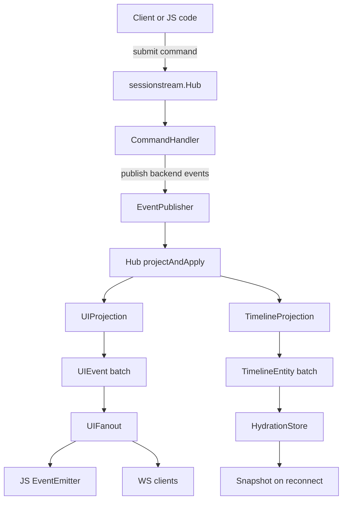
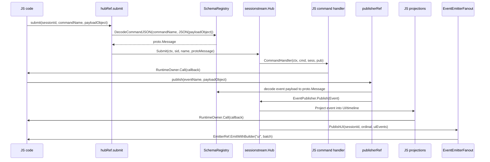

# Goja sessionstream bindings design

## Executive summary

This document proposes a Goja/xgoja integration for `sessionstream`: a native CommonJS module exposed as `require("sessionstream")` that lets JavaScript code build session-scoped, event-driven applications on top of the existing Go framework. The binding should make the existing Go model available in JavaScript without weakening the core framework rule that commands, backend events, UI events, and timeline entities are typed protobuf messages.

The recommended first implementation is intentionally conservative:

1. Add an optional JS binding package under `sessionstream/pkg/js/modules/sessionstream`.
2. Expose `SchemaRegistry`, `Hub`, `EventPublisher`, `TimelineView`, and small helpers through JavaScript wrapper objects.
3. Require schemas to come from Go-provided protobuf prototypes in phase 1, rather than allowing arbitrary JavaScript top-level JSON payloads.
4. Use `runtimeowner.RuntimeOwner` for all JS callback execution, because command handlers and projections may run outside the Goja owner goroutine.
5. Add an EventEmitter fanout adapter that turns `sessionstream.UIFanout` batches into JavaScript `EventEmitter` events using `go-go-goja/pkg/jsevents`.
6. Expose the existing WebSocket server as a `wsServer()` helper that returns a Go `http.Handler`-backed object, and add an explicit mount helper for `gojahttp.Host`/express integration instead of trying to reimplement WebSocket framing in JavaScript.
7. Add an xgoja provider package mirroring Geppetto's provider style so generated xgoja runtimes can select the module, generate TypeScript definitions, and opt into configuration.

The outcome should be that the existing Go chat demo can be written in JavaScript with the same conceptual pieces: register schemas, build a hub, install command handlers, install UI and timeline projections, submit commands, observe fanout, and optionally serve `/ws` with snapshot-before-live reconnect semantics.

## Problem statement and scope

`sessionstream` is a Go framework for applications where clients submit session-scoped commands, handlers publish canonical backend events, projections derive live UI events and durable timeline entities, and reconnecting clients hydrate from snapshots. The framework already has a clean Go API, a WebSocket transport, and a chat demo. The missing piece is a JavaScript authoring surface for xgoja-based hosts.

The requested integration is similar in spirit to Geppetto's Goja bindings: a repository-owned module package that wraps Go types, exposes an ergonomic JS API, and plugs into xgoja's provider registry. The user specifically called out two existing capabilities that should be leveraged:

- the EventEmitter bridge already present in `go-go-goja`; and
- the express-style HTTP framework, potentially for WebSocket/SSE transport.

This document covers the analysis and implementation guide only. It does not implement the binding. It also stays within this workspace: `sessionstream`, `go-go-goja`, `geppetto`, and `glazed` are all checked out in the local `go.work` workspace.

### Explicit non-goals for phase 1

- Do not make `sessionstream` a generic untyped JSON event bus.
- Do not import downstream product behavior into the framework.
- Do not require browser clients to run Goja.
- Do not replace the existing Go WebSocket transport.
- Do not invent a new HTTP framework if `gojahttp.Host` and the express provider can mount the existing `http.Handler`.
- Do not support arbitrary JavaScript-defined protobuf schemas before a descriptor strategy is designed and tested.

## Orientation: what a new intern needs to know first

### Repository layout

The workspace root is `/home/manuel/workspaces/2026-06-12/goja-sessionstream` and uses a Go workspace:

```text
go.work
├── geppetto/       # Existing Goja binding patterns to copy from.
├── glazed/         # CLI/config infrastructure used by xgoja providers.
├── go-go-goja/     # Goja engine, modules, xgoja provider framework, EventEmitter, express.
└── sessionstream/  # Target repository for the new binding.
```

`sessionstream/AGENT.md` states the main repository rule: keep `sessionstream` generic and avoid importing downstream product behavior. This is important because a JS binding can easily become a place where chat-, agent-, or Pinocchio-specific assumptions leak into the framework. The binding should expose framework seams, not product semantics.

### The sessionstream application model

The core model is:



Important types:

- `Command`: external request with `Name`, `SessionId`, and protobuf `Payload`.
- `Event`: canonical backend fact published by handlers.
- `UIEvent`: client-facing projection for live delivery.
- `TimelineEntity`: durable projected state for hydration.
- `HydrationStore`: persistence seam for applying entities and building snapshots.
- `UIFanout`: output seam for live UI events.
- `Hub`: orchestrates command routing, event publication, projection, storage, and fanout.

### The central invariant

The binding should preserve this invariant:

> JavaScript may author behavior, but `sessionstream` remains protobuf-first and sessionstream-owned ordering, projection, fanout, and hydration rules still apply.

That means JavaScript callbacks are allowed to return or publish payloads, but those payloads must be converted into registered `proto.Message` values before they enter the core Hub pipeline.

## Evidence-backed current-state analysis

### Core Hub API

`pkg/sessionstream/hub.go` defines `Hub` as the framework entrypoint. The fields show the architectural seams: registry, hydration store, session registry, command registry, UI projection, timeline projection, fanout, optional bus, error observer, pipeline observer, and ordinal state. See `pkg/sessionstream/hub.go:63-85`.

Construction and configuration happen through `HubOption` values. Relevant options for bindings include:

- `WithSchemaRegistry` for host-provided schemas (`hub.go:90-97`).
- `WithHydrationStore` for persistence (`hub.go:100-107`).
- `WithSessionMetadataFactory` for per-session metadata (`hub.go:110-114`).
- `WithProjectionPolicies` and related helpers for projection failure behavior (`hub.go:117-139`).
- `WithErrorObserver` for surfacing framework errors (`hub.go:142-146`).
- `WithUIFanout` for connecting live output (`hub.go:149-156`).

`NewHub` creates defaults: a new schema registry, a noop hydration store, a default session registry, fail-fast projection policies, and a local ordinal map (`hub.go:159-166`). This is useful for JS because a minimal app can run without external persistence.

Command execution flows through `Submit`, `dispatch`, and `EventPublisher`. `dispatch` looks up a registered command handler and passes it a publisher (`hub.go:319-328`). The local publisher validates the event payload type, assigns an ordinal, and calls `projectAndApply` (`hub.go:342-360`).

### SchemaRegistry is protobuf-first

`pkg/sessionstream/schema.go` stores prototype protobuf messages for commands, events, UI events, and timeline entities (`schema.go:12-18`). It has registration methods for all four categories (`schema.go:29-42`), lookup methods (`schema.go:45-58`), and JSON decode/marshal helpers (`schema.go:61-82`).

This matters for JavaScript because JS objects are not protobuf messages. A binding must decide how JavaScript input becomes a concrete `proto.Message`:

- for command submission, use `SchemaRegistry.DecodeCommandJSON(name, jsonBytes)`;
- for publishing backend events, instantiate the registered event prototype and unmarshal JS JSON into it;
- for projection output, instantiate registered UI event or timeline entity prototypes and unmarshal JS JSON into them;
- for values sent back to JS, marshal with `MarshalProtoJSON` and parse/convert into ordinary JS objects.

### Projection interfaces are small and binding-friendly

`pkg/sessionstream/projection.go` defines:

- `UIEvent` with `Name` and protobuf `Payload` (`projection.go:9-13`);
- `TimelineEntity` with `Kind`, `Id`, ordinal fields, payload, and tombstone (`projection.go:15-23`);
- `TimelineView`, a read-only view with `Get`, `List`, and `Ordinal` (`projection.go:25-30`);
- `UIProjection.Project` (`projection.go:32-35`);
- `TimelineProjection.Project` (`projection.go:44-47`).

These are good JS binding seams because a JS function can be adapted to each interface. The difficult part is not the API shape; it is safe Goja callback execution and payload conversion.

### Hydration and snapshot contract

`pkg/sessionstream/hydration.go` defines `HydrationStore`, `EventStore`, projection cursor support, timeline reset, durable error storage, and `Snapshot`. The core `Snapshot` contains `SessionId`, `SnapshotOrdinal`, and a slice of `TimelineEntity` values. This is the state sent to reconnecting clients.

For JavaScript, the first binding version should expose only read-oriented snapshot helpers:

```js
const snapshot = hub.snapshot("session-1");
console.log(snapshot.snapshotOrdinal);
console.log(snapshot.entities);
```

Writing new stores from JS is possible later but is a larger surface area and should not be the first milestone.

### WebSocket transport is already a fanout adapter

`pkg/sessionstream/transport/ws/server.go` defines `Server` as both `http.Handler` and `sessionstream.UIFanout` (`server.go:127-128`). It takes a `SnapshotProvider`, upgrades HTTP requests to WebSocket connections, handles subscribe/unsubscribe/ping/pong frames, and publishes live UI events to subscribed clients. `NewServer` validates the snapshot provider and initializes connection maps (`server.go:130-152`). `ServeHTTP` upgrades a connection (`server.go:155-175`).

The transport contract is defined in `proto/sessionstream/v1/transport.proto`. Browser clients send `ClientFrame` messages containing subscribe/unsubscribe/ping/pong frames. Servers send hello, snapshot, subscribed/unsubscribed, UI event, error, ping, and pong frames. Payloads are `google.protobuf.Any`.

The existing WebSocket server should be reused rather than reimplemented in JavaScript. The binding should make it easy to mount it.

### go-go-goja EventEmitter support is already designed for cross-goroutine emission

`go-go-goja/modules/events/events.go` implements a Go-native subset of Node's `EventEmitter`. It is not goroutine-safe; all listener work must happen on the owning Goja runtime goroutine.

`go-go-goja/pkg/jsevents/manager.go` solves the cross-goroutine problem. Its installer stores a `Manager` in the runtime initialization context (`manager.go:70-96`). `Manager.AdoptEmitterOnOwner` accepts a JS-created EventEmitter value while on the owner goroutine and returns an `EmitterRef` (`manager.go:112-122`). `EmitterRef.EmitWithBuilder` schedules emission back onto the owner via `RuntimeOwner.Post` (`manager.go:176-202`).

This is exactly what `sessionstream` needs for fanout. `Hub.projectAndApply` may call `UIFanout.PublishUI` from a command handler goroutine, a bus consumer goroutine, or a background run. The JS EventEmitter cannot be touched there. The fanout adapter must hold an `EmitterRef` and schedule emission onto the Goja owner.

### Geppetto's module and EventEmitter integration are the best local precedent

`geppetto/pkg/js/modules/geppetto/module.go` has the module pattern to follow:

- an exported `Options` struct (`module.go:41-59`);
- `NewLoader(opts Options) require.ModuleLoader` (`module.go:61-65`);
- `Register(reg *require.Registry, opts Options)` (`module.go:68-74`);
- a `moduleRuntime` holding `vm`, `runtimeOwner`, bridges, registries, config, EventEmitter manager, and logger (`module.go:80+`);
- a `Loader` that creates runtime state and installs exports (`module.go:164-168` in the file, immediately after the inspected range).

`geppetto/pkg/js/modules/geppetto/api_event_emitters.go` shows the EventEmitter bridge pattern:

1. Resolve or receive a `jsevents.Manager` (`api_event_emitters.go:91-103`).
2. Adopt a JavaScript EventEmitter (`api_event_emitters.go:76-88`).
3. When a Go event arrives, encode it as JSON-like data and call `ref.EmitWithBuilder` to build JS values on the owner runtime (`api_event_emitters.go:106-124`).
4. Close the adopted ref when the run scope ends (`api_event_emitters.go:48-73`).

`sessionstream` should copy this pattern, but at a different seam: `sessionstream.UIFanout` rather than Geppetto's `events.EventSink`.

### xgoja provider and express integration patterns exist

`go-go-goja/pkg/xgoja/providers/http/http.go` registers the `express` module as an xgoja provider module (`http.go:32-43`) and a `serve` command set (`http.go:45-52`). Its loader resolves or creates a `gojahttp.Host`, then calls `express.NewLoader(host, express.WithOnUse(...))` (`http.go:128-148`).

`go-go-goja/pkg/gojahttp/host.go` supports mounting arbitrary `http.Handler` values through `RegisterStaticHandler` and `RegisterStaticHandlerWithOptions`. Despite the name `StaticHandler`, the mounted value is an ordinary `http.Handler`. That means a `sessionstream/transport/ws.Server` can be mounted directly if the binding or provider has access to the host.

`go-go-goja/modules/express/express.go` exposes route registration and static handler mounting through JavaScript. It currently does not expose a public JS method for mounting arbitrary Go `http.Handler` values. Therefore, the sessionstream provider may need one of these approaches:

- use host services directly from Go to mount `ws.Server` at a configured path;
- add a small `sessionstream.mountWebSocket(appOrHost, path, server)` helper in the provider that recognizes the Go-backed server object;
- or extend express/gojahttp later with a general `app.mountHandler(path, handler)` if that is considered broadly useful.

## Gap analysis

### Gap 1: no native `sessionstream` JS module

There is no `pkg/js/modules/sessionstream` equivalent to Geppetto's `pkg/js/modules/geppetto`. Without it, JavaScript cannot construct or control hubs, register callbacks, submit commands, or observe fanout directly.

### Gap 2: protobuf value conversion must be designed

The core framework requires `proto.Message` payloads. JavaScript naturally uses plain objects. The binding needs a strict conversion layer:

- JS object → JSON bytes → registered protobuf prototype;
- protobuf message → protojson bytes → JS object;
- uint64 ordinals → strings in JS where precision matters.

### Gap 3: JS callbacks must respect Goja runtime ownership

`Hub` may call command handlers, projections, observers, or fanout from goroutines not owned by Goja. Directly calling `goja.Callable` from those goroutines would be unsafe. The binding must route through `runtimeowner.RuntimeOwner.Call` or `Post`. `runtimeowner` already handles reentrant calls when the context is already on the owner goroutine, which matters when JS calls `hub.submit()` and that synchronously reaches a JS handler.

### Gap 4: EventEmitter fanout exists, but not for sessionstream

The EventEmitter bridge exists in `go-go-goja`, and Geppetto uses it, but `sessionstream` does not yet have a `UIFanout` adapter that emits JS events.

### Gap 5: WebSocket mounting needs a provider-level story

The WS server is an `http.Handler`, and `gojahttp.Host` can mount handlers, but express's JS API does not currently advertise a generic handler mount. A provider can still solve this by mounting from Go, but the public JS API should be explicit and testable.

## Proposed architecture

### Package layout

Add an optional Goja binding package inside `sessionstream`:

```text
sessionstream/
└── pkg/
    └── js/
        └── modules/
            └── sessionstream/
                ├── module.go              # Options, NewLoader, Register, installExports
                ├── api_types.go           # hubRef, schemaRegistryRef, publisherRef, viewRef, emitterFanoutRef
                ├── api_schema.go          # schemas(), register helpers, decode/marshal helpers
                ├── api_hub.go             # hub(), submit, run, shutdown, snapshot, cursors
                ├── api_handlers.go        # JS CommandHandler adapter
                ├── api_projections.go     # JS UIProjection and TimelineProjection adapters
                ├── api_fanout.go          # EventEmitter UIFanout adapter
                ├── api_ws.go              # websocket server helper and mount integration
                ├── codec.go               # protojson <-> JS object conversion
                ├── typescript.go          # TypeScript module descriptor
                ├── provider/
                │   ├── provider.go        # xgoja ProviderRegistry integration
                │   ├── host_options.go    # optional HostServices integration
                │   └── provider_test.go
                └── *_test.go
```

This mirrors Geppetto while keeping the core framework package (`pkg/sessionstream`) free of Goja dependencies.

### Runtime object model

The module should use hidden Go references on JS wrapper objects, following Geppetto's `hiddenRefKey` pattern.

```go
type Options struct {
    RuntimeOwner runtimeowner.RuntimeOwner
    EventEmitterManager *jsevents.Manager
    EventEmitterManagerResolver func() (*jsevents.Manager, bool)
    DefaultSchemaRegistry *sessionstream.SchemaRegistry
    DefaultHydrationStore sessionstream.HydrationStore
    Host gojahttpHostLike // optional provider-only abstraction
    Logger zerolog.Logger
}

type moduleRuntime struct {
    vm *goja.Runtime
    runtimeOwner runtimeowner.RuntimeOwner
    eventEmitterManager *jsevents.Manager
    eventEmitterManagerResolver func() (*jsevents.Manager, bool)
    defaultSchemaRegistry *sessionstream.SchemaRegistry
    defaultHydrationStore sessionstream.HydrationStore
    hostServices providerapi.HostServices
    lifetime context.Context
    logger zerolog.Logger
}

type schemaRegistryRef struct {
    api *moduleRuntime
    registry *sessionstream.SchemaRegistry
}

type hubRef struct {
    api *moduleRuntime
    hub *sessionstream.Hub
    registry *sessionstream.SchemaRegistry
    closers []func(context.Context) error
}
```

The public JS values should be small facades. JS code should not receive raw Go structs with all methods exported implicitly, because that makes the API unstable and hard to document.

### JavaScript API sketch

The initial API should feel close to the Go API but use JS objects and callbacks.

```ts
import sessionstream = require("sessionstream");
import EventEmitter = require("events");

const schemas = sessionstream.schemas({
  // Phase 1: names point to host-provided prototypes.
  commands: {
    ChatStartInference: "sessionstream.examples.chatdemo.v1.StartInferenceCommand",
    ChatStopInference: "sessionstream.examples.chatdemo.v1.StopInferenceCommand",
  },
  events: {
    ChatUserMessageAccepted: "sessionstream.examples.chatdemo.v1.UserMessageAcceptedEvent",
    ChatInferenceStarted: "sessionstream.examples.chatdemo.v1.InferenceStartedEvent",
    ChatTokensDelta: "sessionstream.examples.chatdemo.v1.TokensDeltaEvent",
  },
  uiEvents: {
    ChatMessageAccepted: "sessionstream.examples.chatdemo.v1.ChatMessageUpdate",
    ChatMessageAppended: "sessionstream.examples.chatdemo.v1.ChatMessageUpdate",
  },
  timelineEntities: {
    ChatMessage: "sessionstream.examples.chatdemo.v1.ChatMessageEntity",
  },
});

const emitter = new EventEmitter();
const fanout = sessionstream.eventEmitterFanout(emitter, {
  names: ["ui", "ui:${name}", "session:${sessionId}"],
});

const hub = sessionstream.hub({
  schemas,
  fanout,
  projectionPolicy: "fail", // or "advance"
});

hub.command("ChatStartInference", async (cmd, session, publisher) => {
  await publisher.publish("ChatUserMessageAccepted", {
    messageId: "msg-1-user",
    role: "user",
    content: cmd.payload.prompt,
    streaming: false,
  });
});

hub.uiProjection((event, session, view) => {
  if (event.name === "ChatUserMessageAccepted") {
    return [{
      name: "ChatMessageAccepted",
      payload: {
        messageId: event.payload.messageId,
        role: event.payload.role,
        content: event.payload.content,
        streaming: false,
        ordinal: event.ordinal,
      },
    }];
  }
  return [];
});

hub.timelineProjection((event, session, view) => {
  if (event.name !== "ChatUserMessageAccepted") return [];
  return [{
    kind: "ChatMessage",
    id: event.payload.messageId,
    payload: {
      messageId: event.payload.messageId,
      role: event.payload.role,
      content: event.payload.content,
      streaming: false,
    },
  }];
});

emitter.on("ui", (batch) => {
  console.log(batch.sessionId, batch.ordinal, batch.events);
});

await hub.submit("session-1", "ChatStartInference", { prompt: "Explain ordinals" });
const snapshot = await hub.snapshot("session-1");
```

### WebSocket API sketch

For WebSocket, the binding should not ask JS to manually pack `ServerFrame` messages. It should expose the existing Go server.

Option A: provider auto-mounts a configured server:

```yaml
xgoja:
  modules:
    - package: sessionstream
      module: sessionstream
      as: sessionstream
      config:
        websocket:
          enabled: true
          path: /sessionstream/ws
```

JS:

```js
const ss = require("sessionstream");
const hub = ss.hub({ schemas });
ss.webSocket.attach(hub, { path: "/sessionstream/ws" });
```

Option B: explicit JS mount through helper:

```js
const express = require("express");
const ss = require("sessionstream");

const app = express.app();
const ws = ss.webSocket.server(hub, { maxHydrationBufferedBatches: 1024 });
ss.webSocket.mount(app, "/ws", ws);
app.listen();
```

Intern implementation note: Option B is only feasible if `mount(app, path, ws)` can access the underlying `gojahttp.Host` or if express gains a general mount helper. Otherwise implement provider-level auto-mount first and add Option B later.

## Key runtime flows

### Flow 1: JS submits a command



Pseudocode:

```go
func (h *hubRef) submit(call goja.FunctionCall) goja.Value {
    sid := parseSessionID(call.Argument(0))
    name := parseName(call.Argument(1))
    payloadJSON := marshalJSValueToJSON(call.Argument(2))

    msg, err := h.registry.DecodeCommandJSON(name, payloadJSON)
    if err != nil { panic(vm.NewGoError(err)) }

    err = h.hub.Submit(runtimeContext(), sid, name, msg)
    if err != nil { return rejectOrThrow(err) }
    return maybePromiseOrUndefined()
}
```

### Flow 2: Go Hub calls a JS command handler

The handler adapter must be safe if invoked from any goroutine.

```go
type jsCommandHandler struct {
    api *moduleRuntime
    fn  goja.Callable
}

func (h jsCommandHandler) Handle(ctx context.Context, cmd sessionstream.Command, sess *sessionstream.Session, pub sessionstream.EventPublisher) error {
    _, err := h.api.runtimeOwner.Call(ctx, "sessionstream.command."+cmd.Name, func(ctx context.Context, vm *goja.Runtime) (any, error) {
        jsCmd, err := h.api.eventToJSCommand(vm, cmd)
        if err != nil { return nil, err }
        jsSess := h.api.sessionToJS(vm, sess)
        jsPub := h.api.publisherObject(vm, pub, cmd.SessionId)
        ret, err := h.fn(goja.Undefined(), jsCmd, jsSess, jsPub)
        if err != nil { return nil, err }
        return h.api.awaitIfPromise(ctx, ret)
    })
    return err
}
```

Important: `RuntimeOwner.Call` is preferable to `Post` because a command handler needs a return value/error. `RuntimeOwner` already checks owner context and invokes directly if the call is reentrant from owner-owned JS code.

### Flow 3: JS projection output becomes typed payloads

A projection callback should return arrays of plain objects. The Go adapter validates and converts each output item.

```js
hub.uiProjection((event, session, view) => [
  { name: "ChatMessageAppended", payload: { messageId: "m1", chunk: "hello" } }
]);

hub.timelineProjection((event, session, view) => [
  { kind: "ChatMessage", id: "m1", payload: { messageId: "m1", content: "hello" } }
]);
```

Pseudocode:

```go
func (p jsUIProjection) Project(ctx context.Context, ev sessionstream.Event, sess *sessionstream.Session, view sessionstream.TimelineView) ([]sessionstream.UIEvent, error) {
    ret, err := p.api.runtimeOwner.Call(ctx, "sessionstream.uiProjection", func(ctx context.Context, vm *goja.Runtime) (any, error) {
        jsEv := p.api.eventToJS(vm, ev)
        jsSess := p.api.sessionToJS(vm, sess)
        jsView := p.api.timelineViewObject(vm, view)
        value, err := p.fn(goja.Undefined(), jsEv, jsSess, jsView)
        if err != nil { return nil, err }
        return p.api.awaitIfPromise(ctx, value)
    })
    if err != nil { return nil, err }
    return p.api.decodeUIEvents(ret)
}

func decodeUIEvents(raw any) ([]sessionstream.UIEvent, error) {
    for each item in rawArray:
        name := item.name
        payloadJSON := JSON.stringify(item.payload)
        prototype := registry.UIEventSchema(name)
        msg := new message from prototype
        protojson.Unmarshal(payloadJSON, msg)
        out = append(out, sessionstream.UIEvent{Name: name, Payload: msg})
}
```

### Flow 4: EventEmitter fanout

The fanout adapter should emit a structured batch. Recommended default events:

- `"ui"`: all batches;
- `"ui:<eventName>"`: once per UI event name;
- `"session:<sessionId>"`: all batches for one session;
- optionally `"ui:<sessionId>:<eventName>"` for fine-grained subscribers.

Batch shape:

```ts
interface UIFanoutBatch {
  sessionId: string;
  ordinal: string;       // string to preserve uint64 precision
  events: Array<{
    name: string;
    payload: any;
  }>;
}
```

Pseudocode:

```go
type eventEmitterFanout struct {
    api *moduleRuntime
    ref *jsevents.EmitterRef
    names []nameTemplate
}

func (f *eventEmitterFanout) PublishUI(ctx context.Context, sid sessionstream.SessionId, ord uint64, events []sessionstream.UIEvent) error {
    batchData := f.api.encodeUIBatch(sid, ord, events) // protojson payload maps
    names := f.expandEventNames(batchData)
    var joined error
    for _, name := range names {
        payloadCopy := cloneJSONMap(batchData)
        err := f.ref.EmitWithBuilder(ctx, name, func(vm *goja.Runtime) ([]goja.Value, error) {
            return []goja.Value{toJSValueOn(vm, payloadCopy)}, nil
        })
        joined = errors.Join(joined, err)
    }
    return joined
}
```

### Flow 5: WebSocket server mount

The WebSocket server already implements `http.Handler` and `UIFanout`. The binding should create it from a hub, then either set it as the hub fanout or combine it with another fanout.

```go
wsServer, err := ws.NewServer(hub)
combined := sessionstream.UIFanoutFunc(func(ctx context.Context, sid sessionstream.SessionId, ord uint64, events []sessionstream.UIEvent) error {
    return errors.Join(
        eventEmitterFanout.PublishUI(ctx, sid, ord, events),
        wsServer.PublishUI(ctx, sid, ord, events),
    )
})
```

Potential API:

```js
const emitter = new EventEmitter();
const ws = ss.webSocket.server(hub);
hub.setFanout(ss.fanout.combine(ss.eventEmitterFanout(emitter), ws.fanout));
ss.webSocket.mount("/ws", ws); // provider-backed helper
```

## Proposed module exports

### Top-level exports

```ts
interface SessionstreamModule {
  version: string;
  schemas(input?: SchemaInput): SchemaRegistry;
  hub(options?: HubOptions): Hub;
  eventEmitterFanout(emitter: EventEmitter, options?: EventEmitterFanoutOptions): UIFanout;
  fanout: {
    combine(...fanouts: UIFanout[]): UIFanout;
    noop(): UIFanout;
  };
  webSocket: {
    server(hub: Hub, options?: WebSocketServerOptions): WebSocketServer;
    attach(hub: Hub, options?: WebSocketAttachOptions): WebSocketServer;
    mount(path: string, server: WebSocketServer): void;
  };
}
```

### `SchemaRegistry`

Phase 1 should support host-known prototypes, not arbitrary JS schema definitions.

```ts
interface SchemaInput {
  commands?: Record<string, string>;          // logical name -> protobuf full name
  events?: Record<string, string>;
  uiEvents?: Record<string, string>;
  timelineEntities?: Record<string, string>;
}

interface SchemaRegistry {
  registerCommand(name: string, protobufFullName: string): void;
  registerEvent(name: string, protobufFullName: string): void;
  registerUIEvent(name: string, protobufFullName: string): void;
  registerTimelineEntity(kind: string, protobufFullName: string): void;
  commandNames(): string[];
  eventNames(): string[];
  uiEventNames(): string[];
  timelineEntityKinds(): string[];
}
```

Intern note: Go's `protoregistry.GlobalTypes` can resolve generated message types by full name only if they are linked into the binary. For tests, use chatdemo generated types or a small test proto package. If this is not reliable, expose host services that directly contribute prototype values by logical name.

### `Hub`

```ts
interface Hub {
  command(name: string, fn: CommandHandler): this;
  uiProjection(fn: UIProjectionHandler): this;
  timelineProjection(fn: TimelineProjectionHandler): this;
  setFanout(fanout: UIFanout): this; // only before first use, or return error after immutable construction
  submit(sessionId: string, commandName: string, payload: any): Promise<void> | void;
  snapshot(sessionId: string): Promise<Snapshot> | Snapshot;
  cursor(sessionId: string): Promise<string> | string;
  eventCursor(sessionId: string): Promise<string> | string;
  projectionCursor(projector: string, sessionId: string): Promise<string> | string;
  run(): Promise<void> | void;
  shutdown(): Promise<void> | void;
}
```

### Handler and projection callback contracts

```ts
interface CommandEnvelope {
  name: string;
  sessionId: string;
  payload: any;
}

interface SessionRef {
  id: string;
  metadata?: any;
}

interface EventPublisher {
  publish(name: string, payload: any, options?: { sessionId?: string }): Promise<void> | void;
}

type CommandHandler = (cmd: CommandEnvelope, session: SessionRef, publisher: EventPublisher) => void | Promise<void>;

interface BackendEventEnvelope {
  name: string;
  sessionId: string;
  ordinal: string;
  payload: any;
}

interface TimelineViewRef {
  ordinal(): string;
  get(kind: string, id: string): TimelineEntity | null;
  list(kind: string): TimelineEntity[];
}

type UIProjectionHandler = (event: BackendEventEnvelope, session: SessionRef, view: TimelineViewRef) => UIEvent[] | Promise<UIEvent[]>;
type TimelineProjectionHandler = (event: BackendEventEnvelope, session: SessionRef, view: TimelineViewRef) => TimelineEntity[] | Promise<TimelineEntity[]>;
```

## Decision records

### Decision: put bindings in an optional `pkg/js/modules/sessionstream` package

- **Context:** The core `pkg/sessionstream` package is clean and generic. Goja bindings will import `goja`, `goja_nodejs`, `go-go-goja`, and possibly xgoja provider APIs.
- **Options considered:** Add methods directly to core types; add an optional package inside `sessionstream`; create a separate repository/module.
- **Decision:** Add an optional package under `pkg/js/modules/sessionstream`, plus a nested provider package.
- **Rationale:** This matches Geppetto's proven local pattern while keeping the core framework independent from JavaScript runtime concerns.
- **Consequences:** The `sessionstream` module gains optional dependencies, but only packages that import the binding pay for them. Tests can be focused by package.
- **Status:** proposed

### Decision: phase 1 uses Go-provided protobuf prototypes

- **Context:** The schema registry requires concrete `proto.Message` prototypes. The README explicitly rejects top-level `google.protobuf.Struct` payloads for framework contracts.
- **Options considered:** Use arbitrary JS objects; use top-level Struct; require Go-provided prototypes; load FileDescriptorSet and use `dynamicpb`.
- **Decision:** Phase 1 requires Go-provided/generated protobuf prototypes, resolved by full name or contributed by host services.
- **Rationale:** This preserves sessionstream's strongest contract and keeps implementation tractable. Dynamic descriptors are useful but deserve a separate design because they affect codegen, validation, and TypeScript generation.
- **Consequences:** Pure-JS schema authoring is not available in phase 1. Users must link generated proto Go packages or have the host contribute prototypes.
- **Status:** proposed

### Decision: use RuntimeOwner for every JS callback

- **Context:** Command handlers, projections, fanout, bus consumers, and background goroutines may run outside the Goja owner thread. Goja values are not safe to call from arbitrary goroutines.
- **Options considered:** Call JS directly; require all Hub usage to happen on owner; use RuntimeOwner.Call/Post; clone callbacks into Go functions.
- **Decision:** Use `RuntimeOwner.Call` for command handlers and projections, and `RuntimeOwner.Post`/`jsevents.EmitterRef.EmitWithBuilder` for asynchronous EventEmitter delivery.
- **Rationale:** This matches go-go-goja's runtime model and Geppetto's event integration. RuntimeOwner also handles reentrant owner calls, which prevents common deadlocks when JS calls into Go and Go synchronously calls back into JS.
- **Consequences:** Callback APIs must be explicit about promise handling and cancellation. Tests must cover owner-thread submission and background fanout.
- **Status:** proposed

### Decision: EventEmitter fanout is a first-class adapter, not an observer side-channel

- **Context:** The user asked to leverage the existing EventEmitter capability. `UIFanout` is the official sessionstream output seam.
- **Options considered:** Emit from pipeline observer; emit from error observer; create `UIFanout` adapter; expose only WebSocket transport.
- **Decision:** Implement `eventEmitterFanout(emitter)` as a `sessionstream.UIFanout` adapter.
- **Rationale:** This keeps live UI delivery in the same place as existing WebSocket fanout. It can be composed with WebSocket fanout and obeys the same batch semantics.
- **Consequences:** EventEmitter delivery failures become fanout errors and may affect `Hub.Submit` if using fail-fast fanout. Provide a combine/fail policy if users need best-effort local observers.
- **Status:** proposed

### Decision: reuse existing WebSocket server and mount it; do not reimplement protocol in JS

- **Context:** `transport/ws.Server` already implements snapshot-before-live behavior, buffering during hydration, protocol frames, and `UIFanout`.
- **Options considered:** Reimplement server frames in JS; add SSE first; expose the existing server; make express own the WebSocket protocol.
- **Decision:** Expose and mount the existing Go server.
- **Rationale:** It preserves tested reconnect semantics and avoids duplicating concurrency-sensitive buffering logic.
- **Consequences:** The binding must solve `http.Handler` mounting in xgoja. SSE can be a later adapter if required.
- **Status:** proposed

## Implementation plan for a new intern

### Phase 0: Set up branch and run baseline checks

1. Work from `sessionstream/`.
2. Run baseline tests:

```bash
cd /home/manuel/workspaces/2026-06-12/goja-sessionstream/sessionstream
go test ./...
```

3. Inspect `go.work` if imports do not resolve. It should include `go-go-goja`, `geppetto`, `glazed`, and `sessionstream`.
4. Do not modify product-specific downstream code.

### Phase 1: Add the native module skeleton

Create:

```text
pkg/js/modules/sessionstream/module.go
pkg/js/modules/sessionstream/api_types.go
pkg/js/modules/sessionstream/codec.go
pkg/js/modules/sessionstream/typescript.go
pkg/js/modules/sessionstream/module_test.go
```

Implement the Geppetto-style loader:

```go
const ModuleName = "sessionstream"
const hiddenRefKey = "__sessionstream_ref"

type Options struct {
    RuntimeOwner runtimeowner.RuntimeOwner
    EventEmitterManager *jsevents.Manager
    EventEmitterManagerResolver func() (*jsevents.Manager, bool)
    DefaultSchemaRegistry *sessionstream.SchemaRegistry
    DefaultHydrationStore sessionstream.HydrationStore
    Logger zerolog.Logger
}

func NewLoader(opts Options) require.ModuleLoader {
    return (&module{opts: opts}).Loader
}

func Register(reg *require.Registry, opts Options) {
    if reg != nil {
        reg.RegisterNativeModule(ModuleName, NewLoader(opts))
    }
}

func (m *module) Loader(vm *goja.Runtime, moduleObj *goja.Object) {
    rt := newRuntime(vm, m.opts)
    exports := moduleObj.Get("exports").(*goja.Object)
    rt.installExports(exports)
}
```

Add exports first as stubs:

```go
func (m *moduleRuntime) installExports(exports *goja.Object) {
    m.mustSet(exports, "version", "0.1.0")
    m.mustSet(exports, "schemas", m.schemasBuilder)
    m.mustSet(exports, "hub", m.hubBuilder)
    m.mustSet(exports, "eventEmitterFanout", m.eventEmitterFanoutBuilder)
    m.installFanoutNamespace(exports)
    m.installWebSocketNamespace(exports)
}
```

Test goal:

```js
const ss = require("sessionstream");
if (ss.version !== "0.1.0") throw new Error("missing version");
```

### Phase 2: Implement codec helpers

Implement these helpers before handlers/projections so every API path uses the same conversion rules:

```go
func (m *moduleRuntime) protoToJSObject(vm *goja.Runtime, msg proto.Message) (goja.Value, error)
func (m *moduleRuntime) jsValueToProto(registry *sessionstream.SchemaRegistry, kind schemaKind, name string, value goja.Value) (proto.Message, error)
func (m *moduleRuntime) eventToJS(vm *goja.Runtime, ev sessionstream.Event) (goja.Value, error)
func (m *moduleRuntime) uiEventToJS(vm *goja.Runtime, ev sessionstream.UIEvent) (map[string]any, error)
func (m *moduleRuntime) timelineEntityToJS(vm *goja.Runtime, ent sessionstream.TimelineEntity) (map[string]any, error)
```

Rules:

- Use `protojson.MarshalOptions{UseProtoNames:false}` for JS-facing output to match existing registry behavior.
- Use `protojson.UnmarshalOptions{DiscardUnknown:false}` for input so typos fail loudly.
- Convert uint64 ordinals to decimal strings in JS-facing objects.
- Treat `null`/`undefined` payloads as errors for commands/events/projections unless a future schema explicitly allows empty messages.

### Phase 3: Implement schemas

Start with one of these strategies:

1. **Host prototype map:** host passes `map[string]proto.Message` in `Options` keyed by full protobuf name.
2. **Global protobuf registry:** resolve generated message types through `protoregistry.GlobalTypes.FindMessageByName`.
3. **Both:** try host map first, then global registry.

Pseudocode:

```go
func (m *moduleRuntime) schemasBuilder(call goja.FunctionCall) goja.Value {
    registry := sessionstream.NewSchemaRegistry()
    input := decodeSchemaInput(call.Argument(0))
    for logicalName, fullName := range input.Commands {
        msg := m.resolvePrototype(fullName)
        registry.RegisterCommand(logicalName, msg)
    }
    // repeat for events, uiEvents, entities
    return m.wrapSchemaRegistry(registry)
}
```

Test with chatdemo generated types linked into the test binary.

### Phase 4: Implement hub construction and command submission

Expose:

```js
const hub = ss.hub({ schemas, fanout, projectionPolicy: "fail" });
hub.submit("session-1", "CommandName", { field: "value" });
hub.snapshot("session-1");
```

Implementation notes:

- `hub({schemas})` should unwrap `schemaRegistryRef` and pass it via `sessionstream.WithSchemaRegistry`.
- If `fanout` is supplied, unwrap a Go `sessionstream.UIFanout` and pass `WithUIFanout`.
- If no store is supplied, use the Hub default noop store.
- For `snapshot`, convert `sessionstream.Snapshot` to JS object with string ordinals.

### Phase 5: Implement JS command handlers

Expose:

```js
hub.command("CommandName", async (cmd, session, publisher) => {
  await publisher.publish("EventName", { ... });
});
```

The Go adapter must:

- hold the `goja.Callable`;
- call it through `RuntimeOwner.Call`;
- pass a publisher object whose `publish` method converts JS payloads to registered event proto messages;
- wait for Promise fulfillment if promise support is already available in the runtime utilities; otherwise document synchronous phase 1 and add Promise support phase 2.

Critical test cases:

- JS handler publishes one event.
- Unknown event name returns a JS-visible error.
- Payload type mismatch returns a JS-visible error.
- Handler can be invoked when `hub.submit` is called from JS without deadlock.

### Phase 6: Implement projections and TimelineView wrapper

Expose:

```js
hub.uiProjection((event, session, view) => []);
hub.timelineProjection((event, session, view) => []);
```

The `view` wrapper should expose:

```js
view.ordinal();
view.get(kind, id);
view.list(kind);
```

Do not expose mutable store operations through `view`. It should remain a read-only facade over `TimelineView`.

Tests:

- UI projection emits typed UI event payloads.
- Timeline projection writes an entity to the store.
- `view.get` returns the previously projected entity on subsequent events.
- Projection error policies match Hub behavior.

### Phase 7: Implement EventEmitter fanout

Expose:

```js
const EventEmitter = require("events");
const emitter = new EventEmitter();
const fanout = ss.eventEmitterFanout(emitter);
const hub = ss.hub({ schemas, fanout });
```

Implementation steps:

1. Resolve `jsevents.Manager` from options or resolver.
2. Adopt the emitter on the owner thread.
3. Return a wrapper holding `sessionstream.UIFanout` and a closer.
4. Emit structured batches as described above.
5. Close EmitterRef when the runtime closes or when JS calls `fanout.close()`.

Tests should use `jsevents.Install()` exactly like Geppetto's tests.

### Phase 8: Implement WebSocket support

Start with a minimal API:

```js
const ws = ss.webSocket.server(hub);
```

This returns a JS wrapper around `*ws.Server`. The wrapper should expose:

```js
ws.connections();
ws.close?();
```

Then integrate mounting. Recommended first path:

- In provider config, accept `websocket.enabled` and `websocket.path`.
- When enabled, build the WS server from the hub and mount it on `gojahttp.Host` from host services.

If a JS-facing mount helper is implemented, make it explicit and narrow:

```js
ss.webSocket.mount("/ws", ws);
```

Do not pretend `express.app().get("/ws", ...)` can serve WebSockets; upgrade handling belongs in the Go `http.Handler`.

### Phase 9: Add xgoja provider

Create `pkg/js/modules/sessionstream/provider/provider.go` mirroring Geppetto:

```go
const PackageID = "sessionstream"

func Register(registry *providerapi.ProviderRegistry) error {
    return registry.Package(PackageID,
        providerapi.Module{
            Name: "sessionstream",
            DefaultAs: "sessionstream",
            Description: "sessionstream Hub, schemas, projections, fanout, and WebSocket helpers exposed as require(\"sessionstream\").",
            ConfigSchema: configSchema,
            TypeScript: sessionstreammodule.TypeScriptModule(),
            NewModuleFactory: func(ctx providerapi.ModuleSetupContext) (require.ModuleLoader, error) {
                opts := sessionstreammodule.Options{RuntimeOwner: ctx.RuntimeOwner}
                // resolve EventEmitter manager, host prototypes, host services, config
                return sessionstreammodule.NewLoader(opts), nil
            },
        },
        providerapi.WithPackageCapability(capability{}),
    )
}
```

Provider config candidates:

```json
{
  "type": "object",
  "properties": {
    "websocket": {
      "type": "object",
      "properties": {
        "enabled": {"type": "boolean"},
        "path": {"type": "string"},
        "maxHydrationBufferedBatches": {"type": "integer", "minimum": 1}
      },
      "additionalProperties": false
    },
    "schemas": {
      "type": "object",
      "description": "Optional host-known logical schema mapping."
    }
  },
  "additionalProperties": false
}
```

### Phase 10: TypeScript declarations

Generate or handwrite a `spec.Module` like other go-go-goja modules. Start handwritten for clarity:

```go
func TypeScriptModule() *spec.Module {
    return &spec.Module{
        Name: "sessionstream",
        RawDTS: []string{
            "type Ordinal = string;",
            "interface Hub { ... }",
            "declare function hub(options?: HubOptions): Hub;",
            "export { hub, schemas, eventEmitterFanout, fanout, webSocket };",
        },
    }
}
```

Run existing xgoja DTS generator tests or add new provider DTS tests.

## Testing and validation strategy

### Unit tests in the binding package

1. `TestModuleExports`: `require("sessionstream")` returns expected functions.
2. `TestSchemasRegisterGeneratedPrototypes`: chatdemo proto types can be registered by full name or host map.
3. `TestHubSubmitInvokesJSCommandHandler`: JS command handler receives decoded command payload.
4. `TestPublisherPublishesTypedEvent`: JS publishes a backend event and Hub validates it.
5. `TestUIProjectionFromJS`: JS projection returns UI events with typed payloads.
6. `TestTimelineProjectionFromJS`: JS projection writes timeline entities and snapshot returns them.
7. `TestEventEmitterFanout`: JS EventEmitter receives `ui` batch after submit.
8. `TestRuntimeOwnerReentrantSubmit`: JS calls `hub.submit`; handler callback does not deadlock.
9. `TestBackgroundPublishFanout`: a Go goroutine publishes an event; EventEmitter receives it via `jsevents.Manager`.
10. `TestWebSocketServerWrapper`: `webSocket.server(hub)` returns a handler/fanout wrapper and can report connections in a server test.

### Integration test mirroring chatdemo

Write a JS script that recreates the behavior of `examples/chatdemo/chat.go` at a small scale:

```js
const ss = require("sessionstream");
const EventEmitter = require("events");

const schemas = ss.schemas(chatSchemas);
const events = new EventEmitter();
const hub = ss.hub({ schemas, fanout: ss.eventEmitterFanout(events) });

const received = [];
events.on("ui", batch => received.push(batch));

hub.command("ChatStartInference", (cmd, session, pub) => {
  pub.publish("ChatUserMessageAccepted", {
    messageId: "m1-user",
    role: "user",
    content: cmd.payload.prompt,
    streaming: false,
  });
});

hub.uiProjection(...);
hub.timelineProjection(...);
hub.submit("s1", "ChatStartInference", { prompt: "hello" });

assert.equal(received.length, 1);
assert.equal(hub.snapshot("s1").entities.length, 1);
```

### Commands to run

From `sessionstream/`:

```bash
go test ./pkg/js/modules/sessionstream/... -count=1
go test ./... -count=1
make schema-vet
```

If provider integration touches xgoja generation, also run relevant `go-go-goja` tests from the workspace:

```bash
cd /home/manuel/workspaces/2026-06-12/goja-sessionstream/go-go-goja
go test ./pkg/xgoja/... ./modules/events/... ./pkg/jsevents/... -count=1
```

## Risks and open questions

### Risk: schema resolution by full protobuf name may not be enough

Generated Go message types are usually registered globally, but tests must confirm that `protoregistry.GlobalTypes.FindMessageByName` works for the target generated packages. If not, host-provided prototypes should be the primary mechanism.

### Risk: Promise handling may be incomplete

Some existing goja wrappers treat JS functions synchronously, while HTTP handler code has promise-specific finishing logic. Decide whether sessionstream callbacks support Promises in phase 1. If yes, centralize an `awaitIfPromise` helper and test cancellation.

### Risk: fanout errors can affect command success

`Hub.projectAndApply` returns fanout errors. If EventEmitter listener errors should not fail command submission, add a fanout option:

```js
ss.eventEmitterFanout(emitter, { errorPolicy: "log" }); // vs "fail"
```

The default should probably be `fail` to match framework visibility, but local observers often want best-effort behavior.

### Risk: WebSocket mount API may require express/gojahttp changes

`gojahttp.Host` can mount handlers from Go, but express's JS API does not expose arbitrary handler mounting. Provider-level auto-mount avoids changing express. A general `app.mountHandler` should only be added if multiple modules need it.

### Risk: dynamic protobuf descriptors are tempting but broad

Loading `FileDescriptorSet` in JS would make the module more self-contained, but it raises questions about TypeScript generation, validation, schema-vet, and browser compatibility. Keep it as a later ticket.

## Alternatives considered

### Alternative 1: expose only WebSocket transport, not Hub construction

This would let JS mount a `ws.Server` around a Go-built Hub but would not let JS author session behavior. It is too narrow for the requested “goja bindings / support” goal.

### Alternative 2: make JavaScript payloads top-level `Struct`

This would be easy but conflicts with the repository's protobuf-first schema policy. It hides contracts from Go, generated frontends, hydration, and reviewers.

### Alternative 3: implement a pure JS sessionstream runtime

A pure JS runtime would avoid some Goja callback issues, but it would duplicate Hub ordering, projection, hydration, and WebSocket semantics. It would also diverge from the Go framework tests.

### Alternative 4: add SSE before WebSocket

SSE is simpler for server-to-client live events, but the repository already has a WebSocket subscribe/unsubscribe/hydration protocol. SSE may be useful later for one-way dashboards, but it should not replace the existing transport in the first binding.

## File reference map

Use these files when implementing or reviewing:

- `sessionstream/pkg/sessionstream/hub.go` — Hub lifecycle, options, Submit, dispatch, publisher, project/apply.
- `sessionstream/pkg/sessionstream/schema.go` — schema registration and protojson helpers.
- `sessionstream/pkg/sessionstream/handler.go` — CommandHandler and EventPublisher contracts.
- `sessionstream/pkg/sessionstream/projection.go` — UIEvent, TimelineEntity, TimelineView, projection interfaces.
- `sessionstream/pkg/sessionstream/fanout.go` — UIFanout adapter seam.
- `sessionstream/pkg/sessionstream/hydration.go` — store, replay, cursor, error, snapshot interfaces.
- `sessionstream/pkg/sessionstream/transport/ws/server.go` — reusable WebSocket handler/fanout.
- `sessionstream/proto/sessionstream/v1/transport.proto` — browser wire contract.
- `sessionstream/examples/chatdemo/chat.go` — executable reference app to reproduce in JS.
- `go-go-goja/modules/events/events.go` — EventEmitter implementation.
- `go-go-goja/pkg/jsevents/manager.go` — safe Go-to-JS EventEmitter bridge.
- `go-go-goja/pkg/runtimeowner/runner.go` — owner-thread Call/Post model.
- `go-go-goja/pkg/gojahttp/host.go` — HTTP host and handler mounting.
- `go-go-goja/pkg/xgoja/providers/http/http.go` — express provider pattern.
- `geppetto/pkg/js/modules/geppetto/module.go` — mature module loader/options pattern.
- `geppetto/pkg/js/modules/geppetto/api_event_emitters.go` — EventEmitter sink adapter precedent.
- `geppetto/pkg/js/modules/geppetto/provider/provider.go` — xgoja provider registration/config pattern.

## Suggested first pull request shape

Keep the first PR small enough to review:

1. Module skeleton with `version`, TypeScript descriptor, and provider registration.
2. Schema registry wrapper using host/global protobuf prototypes.
3. Hub wrapper with `submit`, `snapshot`, and command handler registration.
4. UI/timeline projection adapters.
5. EventEmitter fanout adapter.
6. A JS chatdemo-style integration test.

Defer WebSocket mounting to a second PR if the handler-mounting design requires changes to express or provider host services.

## Final recommendation

Build the integration in two layers:

1. **Core JS module layer:** `require("sessionstream")` wraps schemas, hubs, callbacks, projections, snapshots, and EventEmitter fanout. This layer can be tested without HTTP.
2. **Provider/transport layer:** xgoja provider configuration and WebSocket mounting. This layer integrates with express/gojahttp and should reuse `transport/ws.Server` as-is.

This separation gives the intern a clear path: first make the sessionstream programming model work in JavaScript, then attach browser transport. It also keeps risk contained: if WebSocket mounting needs a broader express change, the core binding remains useful and testable.
