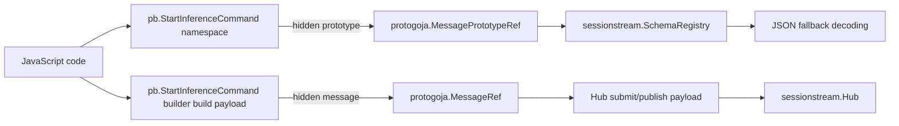
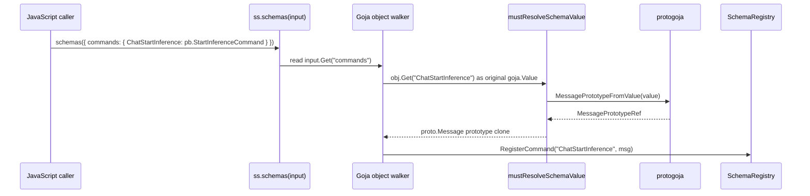

# Goja schema map protobuf namespace analysis and implementation guide

## Executive summary

The `sessionstream` JavaScript module advertises a bulk schema API where callers can write:

```js
const ss = require("sessionstream");
const pb = require("sessionstream.examples.chatdemo.v1");

const schemas = ss.schemas({
  commands: {
    ChatStartInference: pb.StartInferenceCommand,
  },
});
```

That API is not currently reliable. The current implementation decodes the entire JavaScript object through `goja.Runtime.ExportTo` into a Go struct containing `map[string]any` fields. This creates two distinct bugs:

1. The public TypeScript contract uses lower-case section keys (`commands`, `events`, `uiEvents`, `entities`), but the observed `ExportTo` behavior did not populate the Go struct fields from those lower-case keys in the reproduction script. The resulting registry is empty, and later `hub.submit(...)` fails with `unknown command "ChatStartInference"`.
2. If the caller accidentally uses capitalized section names (`Commands`) so that `ExportTo` does populate the Go struct, each generated protobuf namespace object is reduced to a plain `map[string]any`. That strips the hidden `protogoja` schema/prototype token. The exported map keeps public properties such as `typeName`, `builder`, `from`, `is`, and `clone`, but `api_schemas.go` currently only recognizes a public `type` property in map specs.

The proper local fix is to stop using `ExportTo` for schema leaves. `ss.schemas(input)` should walk the original `goja.Value` object, read the four known sections directly, iterate each section object's own keys, and pass each original leaf `goja.Value` to the same resolver used by the fluent `schemas.registerCommand(...)` methods. That preserves hidden generated-protobuf metadata and aligns the bulk API with the fluent API.

The tightened API should support exactly the two forms already advertised by TypeScript: generated `MessageNamespace` objects and protobuf full-name strings. It should not support plain object descriptors such as `{ type: "..." }` or `{ typeName: "..." }`. Those descriptors are not part of the public contract, are easier to spoof, and only exist in the current code because the lossy `ExportTo` path created plain Go maps.

Changing `go-go-goja` itself is optional, not required for the sessionstream fix. The best upstream improvement would be documentation about preserving original `goja.Value` objects until `protogoja` hidden-reference helpers have run. `MessagePrototypeFromValue` should continue to mean hidden-token extraction, not public `typeName` lookup.

## Problem statement and scope

### User-visible problem

The advertised API says this should work:

```ts
export interface SchemaMap {
  commands?: Record<string, string | MessageNamespace>;
  events?: Record<string, string | MessageNamespace>;
  uiEvents?: Record<string, string | MessageNamespace>;
  entities?: Record<string, string | MessageNamespace>;
}

export function schemas(input?: SchemaMap): Schemas;
```

Source: `pkg/js/modules/sessionstream/typescript.go:8-24`.

In JavaScript, `MessageNamespace` means values such as `pb.StartInferenceCommand`. These are generated by `protoc-gen-goja-builder` and represent protobuf message types. They are schema tokens, not payloads.

### Implementation scope

This guide covers:

- `sessionstream/pkg/js/modules/sessionstream/api_schemas.go`, where bulk schema input is decoded and schema names are registered.
- `sessionstream/pkg/js/modules/sessionstream/module.go`, where protobuf full names are resolved and generated namespace hidden tokens are consumed.
- `sessionstream/pkg/js/modules/sessionstream/codec.go`, where payload values are decoded separately from schema tokens.
- `go-go-goja/pkg/protogoja`, which defines hidden references for generated protobuf namespace objects and built protobuf message objects.
- `go-go-goja/cmd/protoc-gen-goja-builder`, which generates the JavaScript namespace API and TypeScript declarations.

This guide intentionally does not implement code. It records the current evidence, design choice, and implementation plan for a follow-up patch.

## Terms and mental model

### Schema registry

`sessionstream.SchemaRegistry` stores prototype protobuf messages keyed by logical names such as `ChatStartInference` or `ChatMessage`. It clones registered messages on input and lookup.

Relevant implementation:

- `pkg/sessionstream/schema.go:11-18`: registry maps for commands, events, UI events, and timeline entities.
- `pkg/sessionstream/schema.go:29-43`: public registration methods.
- `pkg/sessionstream/schema.go:85-101`: `register` validates names and clones prototypes.
- `pkg/sessionstream/schema.go:104-127`: lookup and instantiation clone or create fresh messages.

### Generated protobuf namespace object

A generated namespace object is the JavaScript value exported as `pb.StartInferenceCommand`. It represents a protobuf type. It is not a concrete protobuf message payload.

Generated TypeScript shape:

```ts
export interface MessageNamespace<TMessage, TBuilder> {
  readonly typeName: string;
  builder(): TBuilder;
  from(value: TMessage): TMessage;
  is(value: unknown): value is TMessage;
  clone(value: TMessage): TMessage;
}
```

Evidence:

- `examples/chatdemo/gen/sessionstream/examples/chatdemo/v1/chat_goja.pb.go:45-57`: generated TypeScript namespace interface.
- `examples/chatdemo/gen/sessionstream/examples/chatdemo/v1/chat_goja.pb.go:370-390`: `NewStartInferenceCommandGojaNamespace` constructs a namespace object, attaches a hidden prototype, and sets public `typeName` and `builder`.
- `go-go-goja/cmd/protoc-gen-goja-builder/internal/generator/generator.go:420-475`: generator template for namespace construction.

### Built protobuf message value

A built message is a JavaScript value returned by:

```js
pb.StartInferenceCommand.builder().prompt("hello").build()
```

This value carries a hidden `protogoja.MessageRef`. Go can recover the concrete protobuf payload with `protogoja.MessageFromValue(value)`.

Evidence:

- `go-go-goja/pkg/protogoja/ref.go:57-99`: `ToValue` wraps a protobuf message in a JavaScript object with `typeName`, `toJSON`, `clone`, and `equals`.
- `go-go-goja/pkg/protogoja/ref.go:102-128`: `MessageFromValue` and `MessageRefFromValue` recover the hidden message reference.
- `go-go-goja/cmd/protoc-gen-goja-builder/internal/generator/generator.go:497-503`: generated `build()` returns `protogoja.ToValue(vm, builder.Build())`.

### Hidden prototype token

A generated namespace object carries a hidden Go-owned prototype token. Go can recover it with `protogoja.MessagePrototypeFromValue(value)`. This is the correct schema-token path because it does not trust public JavaScript properties.

Evidence:

- `go-go-goja/pkg/protogoja/prototype.go:11`: hidden property key `__go_go_goja_proto_message_prototype`.
- `go-go-goja/pkg/protogoja/prototype.go:50-73`: `AttachMessagePrototype` stores the token as non-enumerable.
- `go-go-goja/pkg/protogoja/prototype.go:76-91`: `MessagePrototypeFromValue` reads the hidden token.
- `sessionstream/pkg/js/modules/sessionstream/module.go:201-208`: `moduleRuntime.prototypeFromValue` converts a generated namespace token to a fresh prototype message.

## Current-state architecture

### High-level object flow



There are two different hidden-reference paths:

- Schema namespaces use `MessagePrototypeRef`.
- Built message payloads use `MessageRef`.

Conflating the two leads to incorrect fixes. `ss.schemas(...)` needs a schema/prototype token. `hub.submit(...)` needs a payload message.

### Current bulk schema path

Current `schemasBuilder` is implemented as:

```go
type schemaInput struct {
    Commands map[string]any `json:"commands"`
    Events   map[string]any `json:"events"`
    UIEvents map[string]any `json:"uiEvents"`
    Entities map[string]any `json:"entities"`
}

input := schemaInput{}
if arg := call.Argument(0); !goja.IsUndefined(arg) && !goja.IsNull(arg) {
    if err := m.vm.ExportTo(arg, &input); err != nil { ... }
}
for name, spec := range input.Commands {
    msg := m.mustResolveSchemaSpec(spec)
    registry.RegisterCommand(name, msg)
}
```

Evidence: `pkg/js/modules/sessionstream/api_schemas.go:11-53`.

The resolver for exported specs is:

```go
func (m *moduleRuntime) mustResolveSchemaSpec(spec any) proto.Message {
    switch v := spec.(type) {
    case string:
        return resolvePrototype(v)
    case map[string]any:
        if full, ok := v["type"].(string); ok {
            return resolvePrototype(full)
        }
    }
    value := m.vm.ToValue(spec)
    if msg, _, ok := m.prototypeFromValue(value); ok {
        return msg
    }
    panic(TypeError)
}
```

Evidence: `pkg/js/modules/sessionstream/api_schemas.go:56-78`.

This function tries to reconstruct a Goja value after `ExportTo` has already copied the JavaScript value to plain Go data. That is too late for hidden metadata: non-enumerable Go-owned references do not survive as ordinary Go maps.

### Current fluent schema path

The fluent methods do not use `ExportTo`:

```go
m.mustSet(obj, "registerCommand", func(name string, schema goja.Value) goja.Value {
    msg := m.mustResolveSchemaValue(schema)
    registry.RegisterCommand(name, msg)
    return obj
})
```

Evidence: `pkg/js/modules/sessionstream/api_schemas.go:80-112`.

The schema value resolver first checks the hidden prototype token:

```go
func (m *moduleRuntime) mustResolveSchemaValue(value goja.Value) proto.Message {
    if msg, _, ok := m.prototypeFromValue(value); ok {
        return msg
    }
    if value != nil && !goja.IsUndefined(value) && !goja.IsNull(value) {
        if full := value.String(); full != "" && full != "[object Object]" {
            return resolvePrototype(full)
        }
    }
    panic(TypeError)
}
```

Evidence: `pkg/js/modules/sessionstream/api_schemas.go:114-128`.

This is why the existing test passes:

```js
const schemas = ss.schemas();
schemas.registerCommand("ChatStartInference", pb.StartInferenceCommand);
```

Evidence: `pkg/js/modules/sessionstream/module_test.go:46-61`.

### Current payload decoding path

Payload handling is separate and mostly correct. `jsValueToProto` first checks for a generated built message:

```go
if msg, ok := protogoja.MessageFromValue(value); ok {
    validateMessageType(registry, kind, name, msg)
    return proto.Clone(msg), nil
}
```

Only if that fails does it export the JavaScript value to JSON-compatible data and decode with `protojson` using the registered schema prototype.

Evidence: `pkg/js/modules/sessionstream/codec.go:42-68`.

This fallback is intentionally lossy because it is a JSON payload boundary. It is not a schema-token boundary. That difference is central to the design.

## Reproduction evidence

All scripts used to investigate this ticket are stored in the ticket workspace under:

```text
ttmp/2026/06/15/SS-GOJA-SCHEMA-MAP-001--analyze-lossy-goja-schema-map-export-and-protobuf-namespace-handling/scripts/
```

### Script 01: lossy boundary inventory

`01-search-lossy-js-boundaries.sh` searches `sessionstream` JavaScript-facing code for `ExportTo`, `map[string]any`, `map[string]interface{}`, and `.Export()`.

The relevant output is in `sources/01-lossy-js-boundaries.txt`. The only schema-token `ExportTo` boundary found is:

```text
pkg/js/modules/sessionstream/api_schemas.go:12: Commands map[string]any `json:"commands"`
pkg/js/modules/sessionstream/api_schemas.go:25: if err := m.vm.ExportTo(arg, &input); err != nil {
pkg/js/modules/sessionstream/api_schemas.go:64: case map[string]any:
```

Other `map[string]any` usages are JSON output or event/snapshot/fanout shapes, not schema-token inputs.

### Script 02: failure reproduction

`02-reproduce-bulk-schema-failure.sh` creates a temporary Go test and removes it after running. It proves both failure modes.

Observed output in `sources/02-reproduce-bulk-schema-failure.txt`:

```text
--- FAIL: TestTmpBulkSchemaLowercaseNamespaceFails
Error: GoError: unknown command "ChatStartInference"

--- FAIL: TestTmpBulkSchemaCapitalizedNamespaceFailsAfterExportToMap
Error: TypeError: schema values must be protobuf full-name strings or generated message namespace objects
```

Interpretation:

- Lower-case `commands` matches TypeScript but did not populate `schemaInput.Commands` in the reproduction. The registry remained empty.
- Capitalized `Commands` populated the map, but the generated namespace object became a plain map and lost the hidden prototype token.

### Script 03: `ExportTo` inspection

`03-inspect-goja-export-loss.sh` runs a small temporary Go program. It directly inspects the exported `schemaInput` values.

Observed output in `sources/03-inspect-goja-export-loss.txt`:

```text
CASE 1: lower-case SchemaMap key used by TypeScript contract
ExportTo error: <nil>
commands nil: true

CASE 2: capitalized Go struct field name
ExportTo error: <nil>
commands nil: false
command "ChatStartInference" exported as map[string]interface {}
  keys: [builder clone from is typeName]
  typeName: sessionstream.examples.chatdemo.v1.StartInferenceCommand (string)
  type: <nil> (<nil>)
```

This confirms that the `map[string]any` branch in `mustResolveSchemaSpec` is seeing a plain exported object, not the original generated namespace.

## Gap analysis

### Gap 1: bulk API does not match TypeScript contract

The TypeScript declaration promises lower-case keys. The implementation uses a Go struct and `ExportTo`, which did not populate from lower-case keys during reproduction.

Impact:

- Users following TypeScript examples can create an empty schema registry without an immediate error.
- The error appears later at `hub.submit`, which makes the root cause hard to discover.

### Gap 2: schema tokens cross a lossy conversion boundary

Generated protobuf namespace objects carry hidden non-enumerable Go references. `ExportTo` converts JavaScript objects into public Go values. That is incompatible with schema-token semantics.

Impact:

- Generated namespace values that work in `schemas.registerCommand(...)` fail in `schemas({ ... })`.
- The same public value has inconsistent behavior depending on which API form is used.

### Gap 3: undocumented object descriptors are accidental API surface

The bulk `map[string]any` branch recognizes `{ type: "full.name" }`, but the TypeScript `SchemaMap` contract only advertises `string | MessageNamespace`. The object descriptor form is an implementation artifact of the lossy `ExportTo` path, not a clear public API.

Impact:

- Fixing the current bug by expanding the map branch to also accept `{ typeName: "..." }` would promote a third schema-value form that callers do not need.
- Keeping descriptors would blur the intended distinction between generated namespace tokens and explicit protobuf full-name strings.

### Gap 4: no regression test covers the advertised bulk namespace form

There is an existing test for the fluent path, but not for:

```js
ss.schemas({ commands: { ChatStartInference: pb.StartInferenceCommand } })
```

Evidence: `pkg/js/modules/sessionstream/module_test.go:46-61` covers fluent `registerCommand`, not bulk input.

## Proposed design

### Design goal

Make the following forms equivalent:

```js
// Form A: fluent registration
const schemasA = ss.schemas()
  .registerCommand("ChatStartInference", pb.StartInferenceCommand);

// Form B: bulk registration with generated namespace
const schemasB = ss.schemas({
  commands: {
    ChatStartInference: pb.StartInferenceCommand,
  },
});

// Form C: bulk registration with string full names
const schemasC = ss.schemas({
  commands: {
    ChatStartInference: "sessionstream.examples.chatdemo.v1.StartInferenceCommand",
  },
});

// Deliberately unsupported: plain object descriptors.
// Use a generated namespace or a string full name instead.
ss.schemas({
  commands: {
    ChatStartInference: { typeName: "sessionstream.examples.chatdemo.v1.StartInferenceCommand" },
  },
});
```

### Core implementation rule

Do not call `ExportTo` on schema input. Keep schema leaves as `goja.Value` until after `mustResolveSchemaValue` has had the chance to inspect hidden `protogoja` metadata.

### Proposed Go API sketch

Replace `schemaInput` and `mustResolveSchemaSpec(spec any)` with a direct Goja object walker:

```go
type schemaRegistrar func(name string, msg proto.Message) error

func (m *moduleRuntime) schemasBuilder(call goja.FunctionCall) goja.Value {
    registry := ss.NewSchemaRegistry()
    if m.defaultSchemaRegistry != nil && goja.IsUndefined(call.Argument(0)) {
        return m.wrapSchemaRegistry(m.defaultSchemaRegistry)
    }

    if arg := call.Argument(0); !goja.IsUndefined(arg) && !goja.IsNull(arg) {
        input, ok := arg.(*goja.Object)
        if !ok || input == nil {
            panic(m.vm.NewTypeError("schema input must be an object"))
        }
        m.registerSchemaSection("commands", input.Get("commands"), registry.RegisterCommand)
        m.registerSchemaSection("events", input.Get("events"), registry.RegisterEvent)
        m.registerSchemaSection("uiEvents", input.Get("uiEvents"), registry.RegisterUIEvent)
        m.registerSchemaSection("entities", input.Get("entities"), registry.RegisterTimelineEntity)
    }

    return m.wrapSchemaRegistry(registry)
}

func (m *moduleRuntime) registerSchemaSection(section string, value goja.Value, register schemaRegistrar) {
    if value == nil || goja.IsUndefined(value) || goja.IsNull(value) {
        return
    }
    obj, ok := value.(*goja.Object)
    if !ok || obj == nil {
        panic(m.vm.NewTypeError("schema %s must be an object", section))
    }
    for _, name := range obj.Keys() {
        msg := m.mustResolveSchemaValue(obj.Get(name))
        if err := register(name, msg); err != nil {
            panic(m.vm.NewGoError(err))
        }
    }
}
```

Then keep `mustResolveSchemaValue` strict. It should support only:

1. generated namespace hidden prototype tokens;
2. primitive string full names.

```go
func (m *moduleRuntime) mustResolveSchemaValue(value goja.Value) proto.Message {
    if msg, _, ok := m.prototypeFromValue(value); ok {
        return msg
    }
    if full, ok := schemaFullNameFromValue(value); ok {
        msg, err := m.resolvePrototype(full)
        if err != nil {
            panic(m.vm.NewGoError(err))
        }
        return msg
    }
    panic(m.vm.NewTypeError(
        "schema must be a generated message namespace or protobuf full name",
    ))
}
```

Notes for the intern implementing this:

- Do not accept arbitrary objects with `type` or `typeName` properties. They are not part of the tightened API.
- Do not use `value.String()` for arbitrary objects. It can produce `"[object Object]"` and can accidentally accept values that are not primitive strings. Prefer `value.Export().(string)` for string full names.
- Continue resolving full names through `resolvePrototype`, which first checks `Options.Prototypes` and then `protoregistry.GlobalTypes`.

### Flow after the fix



The important property is that the original `goja.Value` reaches `MessagePrototypeFromValue` unchanged.

## Decision records

### Decision: Walk Goja schema input directly instead of using `ExportTo`

- **Context:** Generated protobuf namespace objects carry hidden non-enumerable prototype refs. `ExportTo` copies public data and loses the hidden refs.
- **Options considered:**
  1. Keep `ExportTo` and accept `typeName` in `map[string]any`.
  2. Configure a Goja field-name mapper so lower-case section names populate the struct.
  3. Avoid `ExportTo` and walk the original `goja.Value` object.
- **Decision:** Walk the original Goja object directly.
- **Rationale:** This fixes both the lower-case contract mismatch and hidden-token loss. It also makes bulk registration share the same resolver as fluent registration.
- **Consequences:** Slightly more handwritten object traversal code in `api_schemas.go`, but much clearer schema-token semantics.
- **Status:** proposed.

### Decision: Remove object descriptor fallback

- **Context:** Current code partially accepts `{ type: "full.name" }` only because schema leaves are exported to `map[string]any`. The public TypeScript contract is `string | MessageNamespace`, not arbitrary descriptor objects.
- **Options considered:**
  1. Preserve `{ type: "..." }` and add `{ typeName: "..." }`.
  2. Keep only generated namespaces and primitive string full names.
  3. Remove string support too and require generated namespaces only.
- **Decision:** Keep generated namespaces and primitive string full names; reject object descriptors.
- **Rationale:** This is still unpublished code, so a hard cutover is acceptable. Strings remain useful for config-driven schema maps and for `Options.Prototypes`/`protoregistry.GlobalTypes`, while object descriptors add a redundant and spoofable third form.
- **Consequences:** Any undocumented caller using `{ type: "..." }` must switch to a string full name or generated namespace. The implementation can delete `schemaInput`, `mustResolveSchemaSpec`, and the `map[string]any` branch entirely.
- **Status:** accepted.

### Decision: Do not change `protogoja.MessagePrototypeFromValue` to trust `typeName`

- **Context:** It is tempting to fix this in `go-go-goja` by making `MessagePrototypeFromValue` fall back to public `typeName`.
- **Options considered:**
  1. Make `MessagePrototypeFromValue` trust `typeName`.
  2. Add a separate helper for public type-name extraction.
  3. Leave `go-go-goja` unchanged for this fix.
- **Decision:** Do not change `MessagePrototypeFromValue`; optionally add a separate helper/documentation later.
- **Rationale:** `MessagePrototypeFromValue` currently means "this value carries a Go-owned generated prototype token." Changing it to trust public strings would weaken that semantic boundary and surprise existing consumers.
- **Consequences:** Sessionstream owns the fallback policy because sessionstream intentionally accepts string schema names. `go-go-goja` remains strict and reusable.
- **Status:** proposed.

## Are there other lossy `map[string]any` problems?

The inventory script found several `map[string]any` and `.Export()` sites. The conclusion is that `api_schemas.go` is the only confirmed problematic schema-token boundary.

### Sites that are intentionally JSON-shaped

These sites build outbound JavaScript objects or event payloads. They do not need to preserve hidden protobuf refs:

- `pkg/js/modules/sessionstream/api_hub.go:143-151`: `snapshotToJS` builds a plain JS snapshot object.
- `pkg/js/modules/sessionstream/api_fanout.go:53-61`: fanout batch is a JSON-style event batch.
- `pkg/js/modules/sessionstream/api_view.go:37`: timeline view lists plain objects for JavaScript consumption.
- `pkg/js/modules/sessionstream/codec.go:140-160`: UI events and timeline entities are converted to plain output maps.

### Payload fallback site

`pkg/js/modules/sessionstream/codec.go:59` calls `value.Export()` only after `protogoja.MessageFromValue(value)` fails. That means built generated protobuf payloads take the non-lossy hidden-reference path first. The fallback is for plain JSON-like payload objects.

Caveat: if a JavaScript object contains nested generated `ProtoMessage` values inside an otherwise plain object, the fallback may not preserve them as protobuf messages. That does not appear to be part of the current API contract. If nested protobuf values become a requirement later, implement a recursive proto-aware conversion helper in `go-go-goja` or `sessionstream` instead of relying on `Export()`.

### Hidden sessionstream refs

`pkg/js/modules/sessionstream/module.go:151-168` attaches and reads hidden sessionstream refs for schema registries, hubs, fanouts, and websocket servers. Those refs are consumed from original `goja.Value` arguments. They are not passed through `ExportTo`, so they are not affected by this bug.

## Should `go-go-goja` be upgraded?

### Recommendation

Do not block the sessionstream fix on `go-go-goja` changes. The sessionstream bug is caused by sessionstream exporting schema-token objects to `map[string]any` before resolving them. A local direct-Goja walker fixes the real boundary.

### Useful upstream improvements

A follow-up in `go-go-goja` can still make future consumers safer:

1. **Documentation update:** Add a warning to `pkg/doc/29-protobuf-builders-user-guide.md` and `cmd/protoc-gen-goja-builder/README.md`: generated namespace and message values must be consumed as original `goja.Value`s; `Export`, `ExportTo`, object spread, JSON serialization, or copying only preserves public data such as `typeName`.
2. **Maybe make generated `typeName` read-only:** `protogoja.ToValue` already uses `defineReadOnly` for built message `typeName` (`ref.go:72`). Generated namespaces currently use `obj.Set("typeName", ...)` in the generator (`generator.go:431`). Making namespace `typeName` read-only would align namespace objects with built messages. It should remain enumerable because it is public API and useful for inspection.
3. **Generator test for export behavior:** Add a test showing that `MessagePrototypeFromValue(namespace)` works on the original namespace, while `ExportTo` produces a plain public object. This documents the boundary rather than hiding it.

### Upstream changes to avoid

Avoid changing `protogoja.MessagePrototypeFromValue` so that it constructs a prototype from public `typeName`. That function currently promises hidden-token extraction. Preserving that strong meaning matters for host modules that use it as proof of generated namespace identity.

## Implementation guide for a new intern

### Phase 0: Read the relevant code

Start with these files in order:

1. `pkg/js/modules/sessionstream/typescript.go`
   - Read the public TypeScript contract for `SchemaMap`, `MessageNamespace`, and `schemas(input)`.
2. `pkg/js/modules/sessionstream/api_schemas.go`
   - Understand the current bulk path and fluent path.
3. `pkg/js/modules/sessionstream/module.go`
   - Read `resolvePrototype` and `prototypeFromValue`.
4. `pkg/js/modules/sessionstream/codec.go`
   - Understand payload decoding so you do not confuse schema tokens with payload messages.
5. `examples/chatdemo/gen/sessionstream/examples/chatdemo/v1/chat_goja.pb.go`
   - Read one generated namespace constructor and one builder `build()` method.
6. `/home/manuel/workspaces/2026-06-12/goja-sessionstream/go-go-goja/pkg/protogoja/prototype.go`
   - Understand hidden prototype refs.
7. `/home/manuel/workspaces/2026-06-12/goja-sessionstream/go-go-goja/pkg/protogoja/ref.go`
   - Understand hidden built-message refs.

### Phase 1: Add failing tests first

Add tests to `pkg/js/modules/sessionstream/module_test.go`.

Recommended tests:

```go
func TestSchemasBulkRegisterGeneratedPrototypeNamespaces(t *testing.T) {
    vm := goja.New()
    reg := noderequire.NewRegistry()
    Register(reg, Options{})
    require.NoError(t, chatdemov1.RegisterGojaBuilderFileChatProtoModule(reg, ""))
    reg.Enable(vm)

    _, err := vm.RunString(`
        const ss = require("sessionstream");
        const pb = require("sessionstream.examples.chatdemo.v1");
        const schemas = ss.schemas({
          commands: { ChatStartInference: pb.StartInferenceCommand },
          events: { ChatUserMessageAccepted: pb.UserMessageAcceptedEvent },
          uiEvents: { ChatMessageAccepted: pb.ChatMessageUpdate },
          entities: { ChatMessage: pb.ChatMessageEntity },
        });
        const hub = ss.hub({ schemas });
        hub.command("ChatStartInference", (cmd, session, pub) =>
          pub.publish("ChatUserMessageAccepted", pb.UserMessageAcceptedEvent.builder()
            .messageId("m1")
            .role("user")
            .content(cmd.payload.prompt)
            .build())
        );
        hub.uiProjection((event) => [{
          name: "ChatMessageAccepted",
          payload: pb.ChatMessageUpdate.builder()
            .messageId(event.payload.messageId)
            .role("user")
            .content(event.payload.content)
            .build(),
        }]);
        hub.timelineProjection((event) => [{
          kind: "ChatMessage",
          id: event.payload.messageId,
          payload: pb.ChatMessageEntity.builder()
            .messageId(event.payload.messageId)
            .role("user")
            .content(event.payload.content)
            .build(),
        }]);
        hub.submit("s-1", "ChatStartInference", pb.StartInferenceCommand.builder().prompt("typed").build());
    `)
    require.NoError(t, err)
}
```

Also add focused resolver tests:

```js
// Supported: primitive string full name.
ss.schemas({ commands: { ChatStartInference: "sessionstream.examples.chatdemo.v1.StartInferenceCommand" } })

// Unsupported: plain object descriptors.
ss.schemas({ commands: { ChatStartInference: { typeName: "sessionstream.examples.chatdemo.v1.StartInferenceCommand" } } })
ss.schemas({ commands: { ChatStartInference: { type: "sessionstream.examples.chatdemo.v1.StartInferenceCommand" } } })
```

Make sure each supported test performs an operation that requires the schema, such as `hub.submit(...)`. Merely constructing `ss.schemas(...)` can hide empty-registry failures. For unsupported object descriptors, assert that `ss.schemas(...)` throws immediately.

### Phase 2: Refactor `api_schemas.go`

Perform a small targeted refactor:

1. Remove `fmt` if it is only used for `ExportTo` errors.
2. Delete `schemaInput`.
3. Delete `mustResolveSchemaSpec(spec any)`.
4. Add `schemaRegistrar` and `registerSchemaSection`.
5. Change `schemasBuilder` to use `input.Get("commands")`, `input.Get("events")`, `input.Get("uiEvents")`, and `input.Get("entities")`.
6. Tighten `mustResolveSchemaValue` so it only accepts generated namespaces or primitive string full names.

Be careful with `goja.Value` checks:

```go
if value == nil || goja.IsUndefined(value) || goja.IsNull(value) {
    return
}
```

Do not call `ToObject` on `undefined` or `null` section values.

### Phase 3: Validate behavior

Run:

```bash
go test ./pkg/js/modules/sessionstream -run 'TestSchemas|TestHubCommandProjectionAndSnapshotFromJavaScript' -count=1
go test ./pkg/js/modules/sessionstream -count=1
go test ./... -count=1
```

If the full test suite is too slow or fails due to unrelated integration dependencies, record the exact failure and at least keep the package-level tests passing.

### Phase 4: Optional `go-go-goja` follow-up

If asked to improve upstream `go-go-goja`, create a separate ticket/PR. Keep it small:

1. Add docs warning about `ExportTo` lossiness for generated protobuf objects.
2. Consider a helper named clearly around public type names, not hidden prototypes.
3. Add tests under `pkg/protogoja` or `cmd/protoc-gen-goja-builder` documenting current hidden-token behavior.

Do not mix this with the sessionstream patch unless the sessionstream patch truly requires a new upstream API.

## Test strategy

### Required regression tests

| Test | Purpose |
| --- | --- |
| bulk generated namespace with lower-case `commands` | Covers the advertised failing API. |
| bulk string full name with lower-case `commands` | Ensures string form still works after removing `ExportTo`. |
| bulk `{ typeName }` descriptor rejection | Ensures public descriptor objects do not become supported API. |
| bulk `{ type }` descriptor rejection | Ensures the old map-branch artifact is removed. |
| fluent `registerCommand` existing test | Guards against regression in the existing working path. |
| invalid non-object section | Confirms helpful type errors. |

### Manual smoke snippet

After implementing, this JavaScript should run without error in a Goja test:

```js
const ss = require("sessionstream");
const pb = require("sessionstream.examples.chatdemo.v1");

const schemas = ss.schemas({
  commands: {
    ChatStartInference: pb.StartInferenceCommand,
  },
});

const hub = ss.hub({ schemas });
hub.command("ChatStartInference", () => {});
hub.submit(
  "s-1",
  "ChatStartInference",
  pb.StartInferenceCommand.builder().prompt("hello").build()
);
```

## Risks and review notes

### Risk: hard cutover removes `{ type: "..." }`

This is acceptable because the code is still unpublished and the TypeScript contract never advertised object descriptors. Callers should use either a generated namespace object or a primitive string full name.

### Risk: iteration order is unspecified

`obj.Keys()` order should not matter because schema registration sections are maps. Duplicate logical names within the same JS object cannot exist as distinct own properties.

### Risk: object prototype pollution

Use `obj.Keys()` so only enumerable own keys are registered. Do not walk inherited properties. If stricter behavior is desired later, add tests for `Object.create({ inherited: ... })`.

### Risk: default schema registry behavior

Preserve this behavior exactly:

```go
if m.defaultSchemaRegistry != nil && goja.IsUndefined(call.Argument(0)) {
    return m.wrapSchemaRegistry(m.defaultSchemaRegistry)
}
```

Passing `{}` should create a new empty registry, not return the default registry.

## References

### Sessionstream files

- `/home/manuel/workspaces/2026-06-12/goja-sessionstream/sessionstream/pkg/js/modules/sessionstream/api_schemas.go` — broken bulk schema decoder and fluent schema registration.
- `/home/manuel/workspaces/2026-06-12/goja-sessionstream/sessionstream/pkg/js/modules/sessionstream/module.go` — module runtime, hidden sessionstream refs, protobuf prototype resolution.
- `/home/manuel/workspaces/2026-06-12/goja-sessionstream/sessionstream/pkg/js/modules/sessionstream/codec.go` — payload decoding and JSON fallback.
- `/home/manuel/workspaces/2026-06-12/goja-sessionstream/sessionstream/pkg/js/modules/sessionstream/typescript.go` — public `SchemaMap` and `MessageNamespace` declarations.
- `/home/manuel/workspaces/2026-06-12/goja-sessionstream/sessionstream/pkg/js/modules/sessionstream/module_test.go` — existing fluent schema test and integration test patterns.
- `/home/manuel/workspaces/2026-06-12/goja-sessionstream/sessionstream/pkg/sessionstream/schema.go` — schema registry implementation.
- `/home/manuel/workspaces/2026-06-12/goja-sessionstream/sessionstream/examples/chatdemo/gen/sessionstream/examples/chatdemo/v1/chat_goja.pb.go` — generated chat demo protobuf Goja namespace and builder code.

### Go-go-goja files

- `/home/manuel/workspaces/2026-06-12/goja-sessionstream/go-go-goja/pkg/protogoja/prototype.go` — hidden prototype token API for generated namespaces.
- `/home/manuel/workspaces/2026-06-12/goja-sessionstream/go-go-goja/pkg/protogoja/ref.go` — hidden built-message reference API for payload values.
- `/home/manuel/workspaces/2026-06-12/goja-sessionstream/go-go-goja/cmd/protoc-gen-goja-builder/internal/generator/generator.go` — generator template for namespace objects and builders.
- `/home/manuel/workspaces/2026-06-12/goja-sessionstream/go-go-goja/pkg/doc/29-protobuf-builders-user-guide.md` — user-facing generated protobuf builder documentation.

### Ticket evidence

- `sources/01-lossy-js-boundaries.txt` — inventory of lossy conversion sites.
- `sources/02-reproduce-bulk-schema-failure.txt` — failing temporary tests.
- `sources/03-inspect-goja-export-loss.txt` — direct `ExportTo` inspection output.
- `scripts/01-search-lossy-js-boundaries.sh` — search script.
- `scripts/02-reproduce-bulk-schema-failure.sh` — failure reproduction script.
- `scripts/03-inspect-goja-export-loss.sh` — export inspection script.
