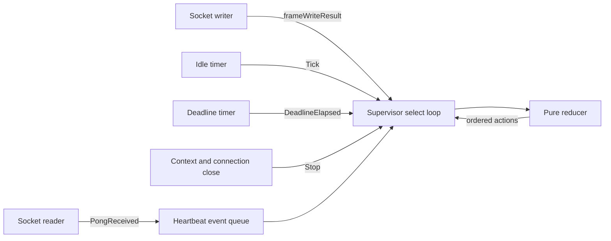
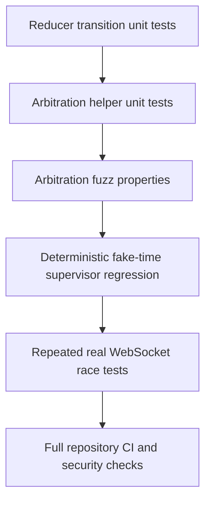

# Intern Guide to Heartbeat Supervisor Event Arbitration and Runtime Fuzzing

## Executive summary

Sessionstream's WebSocket heartbeat is divided into a pure timed failure-detector reducer and a per-connection runtime supervisor. The reducer accepts one ordered event at a time and returns ordered actions. The supervisor receives occurrences from concurrent sources—the socket reader, serialized writer, timers, and shutdown—and decides which reducer event to apply next.

That boundary is essential. A correct reducer cannot repair a valid event that the supervisor delivered too late. PR #11 exposed one such ordering defect. When a ping write acknowledgement is selected after its derived pong deadline has already passed, the `ActionArmDeadline` path immediately injects `EventDeadlineElapsed`. It does not first inspect the bounded heartbeat event queue. If a timely matching pong is already admitted there, the reducer sees deadline before pong and correctly transitions to `Suspected`, but the connection-level result is wrong because runtime arbitration discarded relevant prior evidence.

The normal timer-channel path already drains admitted heartbeat events before applying a deadline. The overdue-on-arm path does not. The implementation should replace these separate policies with one deadline-arbitration helper used by both paths. A deterministic regression must establish the reported schedule. A second, focused native Go fuzz target should generate queue contents, challenge identities, event timestamps, deadline origins, and expiry modes around that helper. The existing reducer fuzzer must remain reducer-focused.

The resulting architecture has two explicit trace contracts:

1. **Reducer contract:** Given an ordered event trace, the detector preserves its state and action invariants.
2. **Supervisor refinement contract:** The runtime transforms concurrent source histories into reducer traces without placing a deadline before a timely matching pong that was already admitted at the deadline decision boundary.

The second contract is the missing test surface. This document specifies it, explains its computer-science foundations, and provides an implementation and validation plan suitable for an engineer new to Sessionstream.

> **Scope status:** Implemented in commit `5a1d9ebfe00e00b9712777d8a1db617753e6f00a` for the PR #11 review finding on `pkg/sessionstream/transport/ws/heartbeat.go`. The change is intentionally narrow. It does not change the public WebSocket schema, `ConnectionConfig`, timeout boundary, single-reader/single-writer architecture, or fixed-threshold failure-detector policy.

## 1. Reader orientation

### 1.1 Repository and branch

Repository:

```text
/home/manuel/workspaces/2026-06-30/benchmark-cpu-inference/sessionstream-p111
```

Implementation branch:

```text
task/sessionstream-005-heartbeat-machine
```

Stacked pull request:

```text
https://github.com/go-go-golems/sessionstream/pull/11
```

PR #11 is stacked on PR #10. PR #10 owns the broader WebSocket lifecycle hardening. PR #11 replaces its legacy heartbeat loop with the explicit detector and supervisor.

### 1.2 Files to read first

Read these files in order:

1. `pkg/sessionstream/transport/ws/internal/heartbeat/machine.go`
   - Pure state machine.
   - Defines phases, events, actions, identity checks, deadline boundary, and terminal behavior.
2. `pkg/sessionstream/transport/ws/heartbeat.go`
   - Runtime supervisor.
   - Owns timers, event queue, nonce creation, writer acknowledgements, reducer invocation, and action interpretation.
3. `pkg/sessionstream/transport/ws/server.go`
   - Connection, one-reader/one-writer lifecycle, outbound frames, and timestamped `frameWriteResult`.
4. `pkg/sessionstream/transport/ws/internal/heartbeat/machine_test.go`
   - Reducer transition tests and `FuzzMachinePreservesInvariants`.
5. `pkg/sessionstream/transport/ws/server_test.go`
   - Real WebSocket and deterministic fake-time supervisor tests.
6. `design-doc/01-intern-guide-to-the-timed-failure-detector-and-websocket-heartbeat-state-machine.md`
   - Full detector architecture.
7. `design-doc/02-pragmatic-stateful-fuzzing-plan-for-the-heartbeat-reducer.md`
   - Existing reducer-fuzzing design and campaign evidence.

### 1.3 Stable compatibility boundaries

This work must preserve:

- application-level protobuf-JSON ping and pong frames;
- opaque nonce echo behavior in browser clients;
- the `ConnectionConfig.HeartbeatInterval` and `ConnectionConfig.PongTimeout` API;
- exactly one Gorilla WebSocket reader and one writer;
- one outstanding heartbeat challenge at a time;
- deadline origin at writer-owned `WriteMessage` completion;
- strict acceptance boundary `pong.At < deadline`;
- timeout meaning suspicion, not proof of remote failure;
- bounded queues and explicit overflow behavior;
- existing transport observation stages.

No compatibility shim or second heartbeat path should be introduced.

## 2. Current architecture

### 2.1 Pure detector

The reducer API is conceptually:

```text
Step : State × Event -> State × Action* + Error
```

The implementation is `(*heartbeat.Machine).Step` in `machine.go:144-170`. It owns no socket, timer, goroutine, channel, context, observer, or protobuf value.

The phases are:

```text
Booting -> Idle -> Writing -> Awaiting -> Idle
                     |          |
                     |          +-> Suspected
                     +------------> Suspected

Any active phase -> Stopped
```

The key state fields are:

```go
type State struct {
    Phase         Phase
    Generation    uint64
    Nonce         string
    WrittenAt     time.Time
    Deadline      time.Time
    PendingPongAt time.Time
}
```

`Generation` protects local write and timer identity. `Nonce` protects wire challenge identity. `PendingPongAt` handles a matching pong that is decoded before the supervisor applies the writer acknowledgement.

When a matching `PingWritten` arrives, the reducer computes:

```text
Deadline = PingWritten.At + PongTimeout
```

When a matching pong arrives in `Awaiting`, it is accepted only if:

```text
Pong.Nonce == State.Nonce
and
Pong.At < State.Deadline
```

A matching deadline is accepted only if:

```text
Deadline.Generation == State.Generation
and
Deadline.At >= State.Deadline
```

These rules are visible in `machine.go:205-277`.

### 2.2 Runtime supervisor

The supervisor is `runHeartbeatSupervisor` in `heartbeat.go:68-215`. It owns one reducer and waits on concurrent sources:



The heartbeat queue has capacity eight (`heartbeat.go:15,29-42`). `offerHeartbeatPong` captures an event timestamp before nonblocking queue admission (`heartbeat.go:53-65`).

The supervisor interprets reducer actions recursively. Important actions include:

- `ActionScheduleTick`: create a one-shot interval timer;
- `ActionSendPing`: enqueue a tracked outbound frame;
- `ActionArmDeadline`: create a one-shot deadline timer or expire immediately;
- `ActionCancelDeadline`: stop and clear the timer;
- `ActionRecordSuspected`: emit timeout observation;
- `ActionCloseConnection`: close idempotently;
- `ActionStop`: terminate the supervisor.

### 2.3 Existing deadline paths

There are two ways a reducer deadline becomes a runtime event.

#### Normal timer expiry

If `ActionArmDeadline` observes a positive delay, the supervisor creates a timer. When its channel becomes ready, the select loop drains admitted heartbeat events first and then applies `EventDeadlineElapsed` (`heartbeat.go:192-212`).

#### Overdue-on-arm expiry

If the supervisor applies `PingWritten` after the derived deadline is already in the past, `ActionArmDeadline` computes `delay <= 0` and immediately applies `EventDeadlineElapsed` (`heartbeat.go:121-126`). This branch does not drain admitted heartbeat events.

The two paths implement different ordering policies for the same semantic operation: deciding whether the current challenge has expired.

## 3. The reported execution

Let:

```text
tw = writer-owned local completion time
tp = reader-owned pong decode/admission time
T  = PongTimeout
d  = tw + T
tr = time when the supervisor resumes
```

The problematic execution satisfies:

```text
tw < tp < d < tr
```

The writer and reader independently place their results in buffered channels while the supervisor is descheduled:

```text
writeAck contains PingWritten(tw, generation=g, nonce=n)
events contains PongReceived(tp, nonce=n)
now() = tr, where tr > d
```

When the supervisor resumes, both channels are ready. Go may select `writeAck` first. The resulting trace is:

```text
1. reducer: PingWritten(tw, g, n)
2. reducer emits ActionArmDeadline(d)
3. runtime sees d - tr <= 0
4. runtime: DeadlineElapsed(tr, g)
5. reducer enters Suspected and requests close
6. queued PongReceived(tp, n) is never allowed to establish success
```

The correct trace, given that the timely pong was already admitted, is:

```text
1. reducer: PingWritten(tw, g, n)
2. reducer emits ActionArmDeadline(d)
3. runtime drains admitted PongReceived(tp, n)
4. reducer accepts tp < d and returns to Idle
5. runtime applies DeadlineElapsed(tr, g)
6. reducer ignores the now-stale generation/phase deadline
```

The reducer behaves correctly in both traces. The supervisor chooses which trace exists.

### 3.1 Why `PendingPongAt` does not solve this execution

`PendingPongAt` handles this order:

```text
PongReceived -> PingWritten
```

It cannot help when the supervisor selects:

```text
PingWritten -> immediate DeadlineElapsed
```

before reading the already-admitted pong. The state machine never receives the pong while in `Writing`, so it cannot store it as pending.

### 3.2 Why the timer-channel drain does not solve this execution

The existing drain executes only when `deadlineC` is selected. In the overdue-on-arm branch, no deadline timer is created. Expiry occurs recursively while interpreting `ActionArmDeadline`, before control returns to the outer select loop.

## 4. Computer-science foundations

### 4.1 Labeled transition systems

The pure detector can be modeled as a labeled transition system:

```text
LTS = (S, E, A, delta, s0)
```

where:

- `S` is detector state;
- `E` is the set of typed events;
- `A` is the set of effect actions;
- `delta` maps one state and event to a new state and ordered actions;
- `s0` is `Booting` with generation zero.

This representation supports exhaustive phase/event tests because `S` and event kinds are finite at the structural level. Time, nonce strings, and generations make the full value space infinite, but equivalence classes reduce it to meaningful boundaries:

- current, previous, future, and empty identity;
- before, exactly at, and after deadline;
- before, at, and after write completion;
- active, suspected, and stopped phase.

The reducer fuzzer exploits those equivalence classes.

### 4.2 Concurrent history versus sequential trace

The supervisor does not receive one naturally ordered event stream. It observes a concurrent history:

```text
H = events produced by reader ∪ writer ∪ timers ∪ shutdown
```

Some pairs have a known order:

- writer captures completion before it sends `frameWriteResult`;
- reader timestamps a pong before queue admission completes;
- challenge generation is assigned before its write result;
- a timer is created after `ActionArmDeadline`.

Other pairs are concurrent from the supervisor's point of view. Go's `select` chooses one ready communication without encoding application priority.

The supervisor constructs a sequential reducer trace:

```text
serialize : H -> E*
```

Correct integration requires more than reducer correctness. `serialize(H)` must be an allowed refinement of the heartbeat protocol's event-order rules.

### 4.3 Trace refinement

A concrete runtime refines an abstract specification when every externally relevant concrete trace corresponds to an allowed abstract trace.

For this system:

- the **abstract specification** says a matching pong timestamped before the deadline prevents suspicion if the runtime admitted it before making the expiry decision;
- the **concrete implementation** uses channels, timers, `select`, recursion through `apply`, and wall/monotonic timestamps.

The review finding is a trace-refinement violation. The concrete runtime creates a trace in which expiry precedes already-admitted timely evidence, even though the abstract arbitration rule requires that evidence to be considered first.

This distinction explains why reducer fuzzing passes. It validates `delta`, not `serialize`.

### 4.4 Partial orders and happens-before

A concurrent execution is better described as a partial order than a total order. Relevant relations include:

```text
WriteMessage return
    happens-before send(frameWriteResult)

Pong decode timestamp capture
    happens-before send(PongReceived)

receive(channel item)
    happens-after successful send(channel item)
```

There is no automatic happens-before relation between the writer's send and reader's send. Both may complete before the supervisor selects either channel.

A timestamp adds domain information but does not itself control channel selection. The supervisor must inspect queued timestamped events before converting elapsed wall time into a terminal protocol decision.

### 4.5 Linearization points

A linearization point is the conceptual instant at which a concurrent operation takes effect atomically in the abstract model.

This design uses these practical points:

- **Pong admission:** successful send into `c.heartbeat.events`.
- **Write-result admission:** successful send into the tracked frame's buffered acknowledgement channel.
- **Deadline decision:** the nonblocking drain observes no admitted heartbeat event and applies `EventDeadlineElapsed`.
- **Connection close:** successful transition of the idempotent close state.

The drain loop's `select { case event := <-events: ...; default: ... }` provides a useful local decision boundary. If a sender can communicate at selection time, the receive is eligible. If default is selected, the implementation linearizes the deadline decision before a later admission.

This does not claim global real-time omniscience. A pong decoded before the deadline but not admitted until after the deadline decision may still lose. The bounded queue and reader scheduling assumptions remain part of the failure detector.

### 4.6 Safety and liveness

Safety properties state that an invalid condition never occurs. Relevant safety properties are:

- at most one challenge is outstanding;
- generation never decreases;
- stale generation events do not affect the current challenge;
- a pong at or after the deadline does not acknowledge the challenge;
- an admitted matching pong before deadline is not ignored by a deadline decision;
- `Stopped` is absorbing;
- every suspicion action is paired with close;
- queues remain bounded.

Liveness properties state that progress eventually occurs under assumptions. Relevant liveness properties are:

- readiness eventually schedules a tick;
- a successful timely pong eventually returns the detector to `Idle`;
- a challenge without a timely pong eventually becomes suspected;
- shutdown eventually stops the supervisor if critical callbacks and socket operations obey their contracts.

Fuzz tests are naturally strong at finding safety violations because one finite input can demonstrate them. Proving liveness with fuzzing is harder because lack of progress may require fairness assumptions or unbounded execution. The runtime harness should test bounded progress obligations instead:

```text
Given a finite admitted mailbox and one deadline decision,
processing terminates within queue-capacity + 1 reducer applications.
```

### 4.7 Failure detectors and timing assumptions

Sessionstream implements a fixed-threshold failure detector. A deadline does not prove remote failure. It means the detector did not accept matching evidence within its configured temporal and scheduling assumptions.

The arbitration rule improves the detector's accuracy by preventing local scheduler delay from discarding evidence already held by the server. It does not make the detector perfect. Remaining uncertainty includes:

- reader descheduling before queue admission;
- network delay;
- client event-loop delay;
- local process pauses;
- queue overflow;
- wall-clock domain misuse if injected clocks violate monotonic consistency.

The correct term remains `Suspected`.

### 4.8 Observational equivalence

Two internal executions may be considered equivalent if they produce the same externally relevant outcome:

```text
final detector phase
action kinds and identities
connection close decision
next tick schedule
transport observations
```

For example, processing a stale pong before a matching deadline and processing that stale pong after the deadline are equivalent with respect to challenge success: both end in `Suspected`. Processing a timely matching pong before versus after the deadline is not equivalent.

This provides an oracle for metamorphic fuzz tests. Reordering events that are independent should not change the abstract outcome; reordering a conflicting timely pong and deadline may change it and therefore must obey the arbitration rule.

## 5. Invariants across the reducer and supervisor boundary

### 5.1 Reducer-local invariants

The existing fuzzer checks or supports these invariants:

```text
R1. State is well formed for its phase.
R2. Generation is monotone.
R3. Stopped is absorbing.
R4. Expected input errors are atomic.
R5. SendPing corresponds to Writing.
R6. ArmDeadline corresponds to Awaiting and stored deadline.
R7. Successful pong actions correspond to Idle.
R8. Suspicion and close actions are paired.
```

These remain in `machine_test.go:264-297,437-469`.

### 5.2 Supervisor refinement invariants

The new harness should add:

```text
S1. Both deadline paths use the same arbitration operation.

S2. Every event admitted before the deadline decision is applied before
    DeadlineElapsed, up to the queue's fixed capacity.

S3. If the admitted set contains a current-nonce pong with At < Deadline,
    the resulting detector phase is Idle, not Suspected.

S4. A current-nonce pong with At == Deadline or At > Deadline does not
    prevent suspicion.

S5. Stale-nonce pongs do not prevent suspicion.

S6. Duplicate pongs cannot replace or erase earlier timely evidence.

S7. Draining terminates after at most heartbeatEventQueueSize receives.

S8. Applying the deadline after a successful pong is harmless because
    phase/generation checks make it stale.

S9. Empty admitted input preserves normal timeout behavior.

S10. Arbitration does not create or resize queues and does not block.
```

### 5.3 The central property

Let:

```text
Q = finite sequence of heartbeat events admitted before expiry arbitration
n = current nonce
d = current deadline
g = current generation
```

Define:

```text
timely(Q, n, d) = exists e in Q such that
    e.Kind == PongReceived
    and e.Nonce == n
    and e.At < d
```

For a machine in `Awaiting(g,n,d)`:

```text
if timely(Q,n,d):
    arbitrate(Q, DeadlineElapsed(at>=d,g)).Phase == Idle
else:
    arbitrate(Q, DeadlineElapsed(at>=d,g)).Phase == Suspected
```

The second branch assumes `Q` contains only pong events, as the production heartbeat event queue currently does. If future event kinds enter the queue, the oracle must account for their transition semantics.

## 6. Proposed architecture

### 6.1 One shared arbitration helper

Extract the bounded drain and deadline application into one package-private helper in `heartbeat.go`:

```go
func applyDeadlineAfterAdmittedEvents(
    events <-chan heartbeat.Event,
    deadline heartbeat.Event,
    apply func(heartbeat.Event),
) {
    for range heartbeatEventQueueSize {
        select {
        case event := <-events:
            apply(event)
        default:
            apply(deadline)
            return
        }
    }
    apply(deadline)
}
```

The helper must be nonblocking. It receives at most the known queue capacity and then applies exactly one deadline event. It does not inspect detector state directly. Reducer identity and timestamp rules remain authoritative.

A slightly more general form may use `cap(events)` rather than the constant. The constant is preferable while the queue capacity is a fixed protocol/runtime bound because:

- tests can assert the exact work bound;
- a nil or unexpectedly unbuffered channel cannot silently disable intended draining;
- the helper and queue construction visibly share one named constraint.

### 6.2 Use the helper for overdue-on-arm

Proposed action branch:

```go
case heartbeat.ActionArmDeadline:
    stopTimer(deadlineTimer)
    now := s.heartbeatNow()
    delay := action.Deadline.Sub(now)
    if delay <= 0 {
        applyDeadlineAfterAdmittedEvents(
            c.heartbeat.events,
            heartbeat.Event{
                Kind:       heartbeat.EventDeadlineElapsed,
                At:         now,
                Generation: action.Generation,
            },
            apply,
        )
        continue
    }
    deadlineTimer = s.newHeartbeatTimer(delay)
    deadlineC = deadlineTimer.C()
    deadlineGeneration = action.Generation
```

Capture `now` once. Calling `heartbeatNow` twice can create unnecessary boundary ambiguity and makes deterministic tests harder to interpret.

### 6.3 Use the helper for timer-channel expiry

Proposed select branch:

```go
case at := <-deadlineC:
    deadlineC = nil
    applyDeadlineAfterAdmittedEvents(
        c.heartbeat.events,
        heartbeat.Event{
            Kind:       heartbeat.EventDeadlineElapsed,
            At:         at,
            Generation: deadlineGeneration,
        },
        apply,
    )
```

This removes duplicated arbitration logic. A future change cannot fix one deadline path while forgetting the other without bypassing the shared named operation visibly.

### 6.4 Why the helper applies the deadline after a successful pong

The helper should not inspect state and conditionally suppress the deadline. Applying it is useful:

- it keeps the helper generic and deterministic;
- it exercises reducer stale-event handling;
- it avoids a second source of phase logic outside the reducer;
- it makes the trace explicit: admitted events first, selected deadline second.

After a successful pong, the reducer is `Idle`. `EventDeadlineElapsed` is a no-op there. If processing an admitted event stops the machine or closes the connection, the supervisor's `apply` closure already ignores later events through its `stopped` guard.

### 6.5 Resource bound

The operation cost is bounded:

```text
0 <= drained events <= heartbeatEventQueueSize
reducer applications <= heartbeatEventQueueSize + 1
additional allocations = 0
blocking receives = 0
```

With capacity eight, deadline arbitration performs at most nine reducer applications. This is acceptable on a control path and protects against an event producer continuously refilling the queue.

## 7. Deterministic regression design

### 7.1 Required test

Add a package-level test near the supervisor tests, for example:

```text
TestHeartbeatOverdueWriteAckDrainsAdmittedTimelyPong
```

The test must establish:

```text
Machine state before arbitration: Awaiting(g,n,d)
Supervisor clock: now > d
Heartbeat queue: PongReceived(tp,n), where tp < d
Expiry source: overdue ActionArmDeadline path
Expected phase: Idle
Expected close: false
Expected timeout observation: absent
```

### 7.2 Preferred seam

The extracted helper is directly testable without real sockets or scheduler sleeps. Create a reducer in `Awaiting`, fill a bounded event queue, and record actions through an `apply` closure.

Pseudocode:

```go
func TestDeadlineArbitrationDrainsTimelyPong(t *testing.T) {
    machine := machineAwaitingChallenge(t, writtenAt, timeout, nonce)
    events := make(chan heartbeat.Event, heartbeatEventQueueSize)
    events <- PongReceived(nonce, deadline - 1ns)

    var actionKinds []heartbeat.ActionKind
    apply := func(event heartbeat.Event) {
        actions := mustStep(machine, event)
        append action kinds
    }

    applyDeadlineAfterAdmittedEvents(
        events,
        DeadlineElapsed(generation, deadline + 1s),
        apply,
    )

    require.Equal(PhaseIdle, machine.State().Phase)
    require.Contains(ActionRecordPong)
    require.NotContains(ActionRecordSuspected)
    require.NotContains(ActionCloseConnection)
}
```

### 7.3 Wiring regression

A helper test proves helper semantics but not that both production branches call it. Add a focused supervisor test for the overdue-on-arm path if it can be made deterministic through existing fake-clock and tracked-frame seams.

The test should avoid probabilistic channel selection. Acceptable approaches, in preference order:

1. Factor the `ActionArmDeadline` interpretation into a package-private function and call that function directly.
2. Add a narrow package-private supervisor seam invoked by production and tests.
3. Use a synchronization hook only if it expresses a durable runtime boundary and does not exist solely to pause a test.
4. Do not depend on `time.Sleep`, `GOMAXPROCS`, repeated random `select`, or hoping the writer acknowledgement wins.

The implementation should prefer a small directly testable operation over scheduler manipulation.

## 8. Runtime fuzz-harness design

### 8.1 Keep the reducer fuzzer intact

`FuzzMachinePreservesInvariants` tests arbitrary reducer traces. Its decoder maps each byte to:

```text
operation bits 0..2
identity bits 3..4
time bits 5..7
```

It is valuable because it explores phase transitions, malformed identities, time boundaries, action contracts, atomic errors, and absorbing stop. It should not gain channels, timers, or supervisor state.

Reasons to keep it separate:

- failures remain attributable to reducer semantics;
- corpus entries remain compact and interpretable;
- state-aware `Advance` continues to produce deep legal traces;
- runtime scheduling assumptions do not contaminate pure transition properties;
- fuzz throughput stays high.

### 8.2 Add a second focused target

Add a target in the `ws` package, preferably in a new file:

```text
pkg/sessionstream/transport/ws/heartbeat_arbitration_test.go
```

Proposed name:

```go
func FuzzHeartbeatDeadlineArbitration(f *testing.F)
```

This target tests the supervisor's serialization policy over a bounded admitted mailbox. It should not open real sockets or start goroutines. Its subject is the extracted arbitration function.

### 8.3 Input representation

One compact representation is:

```text
byte 0:
  bits 0..1  expiry mode
  bits 2..3  current generation mode
  bits 4..7  reserved or queue policy

bytes 1..8:
  bits 0..2  event kind/time class
  bits 3..4  nonce identity class
  bits 5..7  timestamp class
```

Because the production queue has capacity eight, truncate event bytes to eight. This gives a hard work bound and maps directly to the runtime resource invariant.

Suggested event classes:

```text
0 = current pong before deadline
1 = current pong exactly at deadline
2 = current pong after deadline
3 = stale-nonce pong before deadline
4 = empty-nonce pong before deadline
5 = duplicate current pong before deadline
6 = current pong before write completion
7 = current pong far after deadline
```

Suggested expiry modes:

```text
0 = timer-channel expiry at deadline
1 = timer-channel expiry after deadline
2 = overdue-on-arm expiry just after deadline
3 = overdue-on-arm expiry far after deadline
```

The helper itself receives the same deadline event for all modes. The mode remains useful if the harness invokes a shared production function that distinguishes timer creation from immediate expiry.

### 8.4 State construction

Every fuzz case should begin from a valid reachable state, not by mutating private fields. Use reducer events:

```text
Ready(t0)
Tick(t1, nonce=n)
PingWritten(tw, generation=1, nonce=n)
```

The machine then holds:

```text
Phase = Awaiting
Generation = 1
Nonce = n
Deadline = tw + PongTimeout
```

This construction ensures the harness tests the public reducer contract and will detect changes in action shape.

### 8.5 Oracle

Compute the expected result independently from the helper:

```go
hasTimelyCurrent := false
for _, event := range decodedQueue {
    if event.Kind == heartbeat.EventPongReceived &&
       event.Nonce == currentNonce &&
       event.At.Before(deadline) {
        hasTimelyCurrent = true
    }
}

applyDeadlineAfterAdmittedEvents(events, deadlineEvent, apply)

if hasTimelyCurrent {
    require.Equal(heartbeat.PhaseIdle, machine.State().Phase)
    require.Zero(closeActions)
    require.Zero(suspectActions)
} else {
    require.Equal(heartbeat.PhaseSuspected, machine.State().Phase)
    require.Equal(1, closeActions)
    require.Equal(1, suspectActions)
}
```

Do not derive the oracle by calling the same helper or by replaying events through a second copy of identical implementation logic. The predicate should be small and specification-shaped.

### 8.6 Action properties

For every generated queue:

- exactly one deadline event is attempted;
- no reducer error occurs for a valid generated deadline;
- a timely current pong yields one successful-pong action sequence;
- no timely current pong yields one suspicion/close pair;
- stale pongs may yield stale-record actions but cannot change success classification;
- final state is well formed;
- generation remains one;
- the input slice is not mutated;
- the event channel is empty after arbitration unless the input exceeded capacity and was intentionally truncated.

### 8.7 Seeds

Readable seeds are mandatory. Include at least:

1. empty queue → suspected;
2. one current pong one nanosecond before deadline → idle;
3. one current pong exactly at deadline → suspected;
4. one current pong one nanosecond after deadline → suspected;
5. one stale pong before deadline → suspected;
6. stale pong followed by timely current pong → idle;
7. timely current pong followed by late duplicate → idle;
8. late duplicate followed by timely current pong → idle;
9. eight stale pongs → suspected;
10. seven stale pongs plus one timely current pong in the final slot → idle.

The final seed proves the drain reaches the queue capacity boundary.

### 8.8 Campaign commands

Seed regression:

```bash
GOWORK=off go test \
  ./pkg/sessionstream/transport/ws \
  -run='^FuzzHeartbeatDeadlineArbitration$' \
  -count=100
```

Race-enabled seeds:

```bash
GOWORK=off go test -race \
  ./pkg/sessionstream/transport/ws \
  -run='^FuzzHeartbeatDeadlineArbitration$' \
  -count=100
```

Ten-minute campaign:

```bash
GOWORK=off go test \
  ./pkg/sessionstream/transport/ws \
  -run='^$' \
  -fuzz='^FuzzHeartbeatDeadlineArbitration$' \
  -fuzztime=10m
```

A race-enabled fuzz campaign is not required for shipment. The target has no goroutines by design; race-enabled seed repetition plus existing real-supervisor race tests provide better cost-to-signal.

## 9. Fuzzing design techniques

### 9.1 Property-based testing

Property-based testing checks laws across generated input rather than enumerating only examples. The useful form is:

```text
for all generated x satisfying precondition P:
    implementation(x) satisfies invariant I
```

For arbitration:

```text
for all admitted queues Q of length <= 8:
    final success classification == timely(Q,currentNonce,deadline)
```

Properties should describe observable contracts, not duplicate source code.

### 9.2 Model-based testing

Model-based testing compares an implementation with a smaller abstract model. The pure reducer is already a model-like production kernel. The arbitration oracle is an even smaller set predicate over admitted events.

Use a model when:

- the implementation contains channels, callbacks, or mutable runtime state;
- the expected result can be stated with fewer transitions;
- equivalence classes are clearer than concrete examples;
- implementation and oracle do not share the same control flow.

Avoid building an oracle as complex as the implementation. Two identical bugs do not produce a useful differential test.

### 9.3 Stateful fuzzing

Stateful fuzzing interprets bytes as operations over persistent state. It is appropriate for the reducer because valid behavior depends on phase, generation, and prior events.

Useful techniques include:

- an `Advance` operation that chooses a legal progress event from current phase;
- generated stale operations around the legal path;
- state-dependent identity generation;
- state-dependent boundary time generation;
- a hard operation limit;
- invariant checks after every step.

This prevents a fuzzer from spending most executions in shallow invalid states.

### 9.4 Grammar- or structure-aware generation

Raw random bytes often produce invalid or low-value inputs. A decoder can impose a grammar:

```text
Trace := Ready Challenge (Pong | Deadline | Stop)*
Challenge := Tick WriteResult
Pong := Identity × TimeClass
Deadline := Generation × TimeClass
```

The byte encoding should retain enough irregularity to explore malformed cases while making legal deep traces common.

### 9.5 Boundary-value generation

Timed systems usually fail at boundaries. Generate representatives intentionally:

```text
deadline - 1ns
deadline
deadline + 1ns
write time - 1ns
write time
write time + 1ns
zero time
large positive offset
```

Do not rely on a mutational fuzzer to discover exact equality frequently.

### 9.6 Equivalence partitioning

Large domains can be divided into classes with the same expected behavior:

```text
Identity: current | previous | future | empty
Time: timely | exact | late
Phase: writing | awaiting | terminal
Admission: absent | admitted | overflowed
Expiry: timer | overdue-on-arm
```

Cross-product coverage of these classes is more valuable than arbitrary strings and durations.

### 9.7 Metamorphic testing

A metamorphic property relates multiple executions without requiring a complete expected output for each.

Examples:

- inserting a stale pong must not turn suspicion into success;
- duplicating a timely pong must not turn success into suspicion;
- moving a timely pong among positions inside the admitted queue must preserve success;
- replacing a timely pong timestamp with exact deadline must change success to suspicion if no other timely pong exists;
- replacing current nonce with stale nonce must remove its acknowledging effect;
- appending a stale deadline generation after success must not change `Idle`.

Metamorphic operations help a fuzzer explore relational bugs, especially accidental last-wins behavior.

### 9.8 Differential testing

Differential testing runs two implementations against the same input. Possible future use:

```text
reference mailbox model
versus
production arbitration helper
```

It is appropriate only if the reference implementation is independently structured. A simple slice filter and classification model is preferable to another channel-drain loop.

### 9.9 Schedule exploration

Native Go fuzzing mutates data, not scheduler decisions directly. There are three pragmatic ways to test scheduling:

1. Encode a schedule as data and execute operations deterministically.
2. Test the serialization helper without goroutines.
3. Run real integration tests repeatedly under `-race` for actual runtime interference.

For this bug, option 2 gives the strongest deterministic signal. A future richer supervisor harness could encode source-mailbox readiness and selected-source order as bytes, but it should remain bounded and avoid recreating a full scheduler.

### 9.10 Shrinking and failure readability

Go's fuzz engine minimizes failing byte slices. Decoders should make small inputs meaningful so the minimized corpus remains readable.

Good design:

```text
[]                  -> empty queue timeout
[0]                 -> one timely current pong
[1]                 -> one exact-deadline pong
[3,0]               -> stale then timely
```

Poor design requires dozens of bytes of checksums, indexes, or dependent lengths before any event is valid.

### 9.11 Coverage guidance

Coverage is a search heuristic, not a correctness metric. A campaign finding 276 interesting inputs does not prove 276 semantic classes, and zero failures does not prove absence of defects.

Use coverage to guide mutation while separately auditing:

- invariant completeness;
- oracle independence;
- seed quality;
- boundary classes;
- production wiring;
- real concurrency behavior.

## 10. Testing pyramid for this change



Each level catches a distinct defect class:

| Layer | Detects | Does not establish |
|---|---|---|
| Reducer unit tests | transition and exact boundary errors | supervisor ordering |
| Helper unit tests | bounded drain semantics | production wiring unless shared seam is used |
| Helper fuzzing | queue combinations and relational properties | real scheduler behavior |
| Fake-time supervisor | deadline-origin and branch wiring | broad random combinations |
| Real WebSocket race tests | transport interference and races | exhaustive event classes |
| Full CI | repository integration | protocol proof |

No single layer replaces the others.

## 11. API and file-level implementation guide

### 11.1 `pkg/sessionstream/transport/ws/heartbeat.go`

Add the package-private arbitration helper near `offerHeartbeatPong` or immediately before `runHeartbeatSupervisor`.

Requirements:

- receive-only event channel;
- typed deadline event argument;
- injected `apply` callback;
- at most eight nonblocking receives;
- exactly one deadline callback invocation;
- no state inspection;
- no goroutine creation;
- no timer creation;
- no allocation requirement.

Replace both deadline application sites with this helper.

### 11.2 `pkg/sessionstream/transport/ws/heartbeat_arbitration_test.go`

Create a focused new test file rather than expanding the already large `server_test.go` unless repository convention strongly prefers the latter.

Include:

- reachable-machine construction helper;
- deterministic timely-pong regression;
- exact/late/stale table tests;
- queue-capacity boundary test;
- `FuzzHeartbeatDeadlineArbitration`;
- action collection and final-state assertions.

Do not start a server or open sockets in the fuzz callback.

### 11.3 `pkg/sessionstream/transport/ws/server_test.go`

Add or retain one test that proves the overdue-on-arm production path uses shared arbitration. Reuse:

- `newFakeHeartbeatClock`;
- `newHeartbeatRuntime`;
- buffered `connection.send`;
- tracked `outboundFrame.written` acknowledgement;
- `offerHeartbeatPong`;
- connection close state and transport observer records.

If deterministic orchestration requires invasive hooks, prefer factoring one package-private action interpreter seam and testing it directly.

### 11.4 Documentation

Update:

- SESSIONSTREAM-005 diary with the review trace, failed attempts, final API, tests, campaign results, and commits;
- ticket changelog with absolute related file notes;
- this document with actual implementation deviations and campaign evidence;
- README only if public operational behavior changes. The intended correction does not change the declared behavior.

## 12. Phased implementation plan

### Phase 0: Preserve the failing trace

1. Copy the exact review schedule into a deterministic test description.
2. Confirm the current code would classify the trace as suspected.
3. Avoid committing a permanently failing test if branch workflow requires green intermediate commits; otherwise use test-first development.

Acceptance:

```text
The test distinguishes queued timely pong from late or stale pong.
```

### Phase 1: Extract arbitration

1. Add `applyDeadlineAfterAdmittedEvents`.
2. Move the timer-channel drain into it without semantic change.
3. Route overdue-on-arm through it.
4. Capture `now` once in `ActionArmDeadline`.
5. Format and run focused tests.

Acceptance:

```text
One named function owns admitted-event-before-deadline policy.
No duplicated drain loop remains.
```

### Phase 2: Deterministic coverage

1. Add timely queued pong regression.
2. Add empty, exact, late, stale, duplicate, and final-slot cases.
3. Test action pairing and final state.
4. Run each focused test 100 times.

Acceptance:

```text
No sleeps or probabilistic select outcomes are required.
```

### Phase 3: Focused fuzz target

1. Add compact bounded decoder.
2. Add ten readable seeds.
3. Build an independent `timely` oracle.
4. Assert final phase, action pairing, generation, queue drain, and absence of errors.
5. Cap input to eight admitted events.

Acceptance:

```text
The seed suite traverses both success and suspicion.
A mutation can move identity, timestamp, and queue position independently.
```

### Phase 4: Validation

Run:

```bash
GOWORK=off go test ./pkg/sessionstream/transport/ws -count=1
GOWORK=off go test -race ./pkg/sessionstream/transport/ws -count=1
GOWORK=off go test ./pkg/sessionstream/transport/ws \
  -run='^FuzzHeartbeatDeadlineArbitration$' -count=100
GOWORK=off go test -race ./pkg/sessionstream/transport/ws \
  -run='^FuzzHeartbeatDeadlineArbitration$' -count=100
GOWORK=off go test ./pkg/sessionstream/transport/ws \
  -run='^$' -fuzz='^FuzzHeartbeatDeadlineArbitration$' -fuzztime=10m
GOWORK=off go test -race ./... -count=1
make ci-check
lefthook run pre-push
```

Acceptance:

```text
No failure corpus.
No race report.
No lint or generated-file drift.
GitHub check and security workflows pass.
```

### Phase 5: Review closure

1. Push code and documentation commits.
2. Reply to the PR thread with commit, regression, fuzz, and validation evidence.
3. Resolve only after the pushed code is visible.
4. Confirm no unresolved PR #11 threads remain.

## 13. Decision records

### Decision: Keep reducer and supervisor fuzz targets separate

- **Context:** The reported defect is in runtime event serialization, while the existing fuzzer tests pure reducer transitions.
- **Options considered:** Extend the existing reducer target with channels; add a second focused runtime target; replace the reducer target with end-to-end WebSocket fuzzing.
- **Decision:** Add a second focused arbitration target and retain the reducer target unchanged.
- **Rationale:** This preserves fault localization, model clarity, throughput, and compact corpora while covering the missing refinement boundary.
- **Consequences:** Two fuzz commands exist. Their names and documentation must make the boundary clear.
- **Status:** accepted

### Decision: Share one deadline arbitration helper

- **Context:** Timer expiry drains admitted events, but overdue-on-arm expiry does not.
- **Options considered:** Duplicate the drain in the immediate branch; suppress immediate expiry and always create a zero timer; centralize both paths.
- **Decision:** Centralize both paths in one nonblocking helper.
- **Rationale:** A named shared policy prevents semantic drift and is directly testable.
- **Consequences:** Deadline handling gains one package-private callback helper. Reducer semantics remain unchanged.
- **Status:** accepted

### Decision: Preserve reducer authority over identity and time

- **Context:** The arbitration helper could filter for matching/timely pongs itself.
- **Options considered:** Filter in the helper; sort events by timestamp; feed admitted events to the reducer in queue order and then apply deadline.
- **Decision:** Feed all admitted events to the reducer, then the deadline.
- **Rationale:** Nonce, generation, phase, and strict deadline checks already have one authoritative implementation.
- **Consequences:** Stale events may produce observation actions before expiry, but no transition logic is duplicated.
- **Status:** accepted

### Decision: Bound draining by queue capacity

- **Context:** Producers can continue admitting pongs while arbitration runs.
- **Options considered:** Drain until empty without a bound; snapshot `len`; close or swap the queue; process at most capacity.
- **Decision:** Process at most `heartbeatEventQueueSize` events nonblockingly.
- **Rationale:** It guarantees termination and covers every event that could have occupied the bounded queue when arbitration began.
- **Consequences:** Events admitted after the decision linearization may remain for later processing or connection close. This is compatible with fixed-threshold suspicion semantics.
- **Status:** accepted

### Decision: Use deterministic scheduling as data

- **Context:** Native fuzzing does not reliably control Go `select` scheduling.
- **Options considered:** Depend on repeated scheduler races; add sleeps and `GOMAXPROCS`; encode mailbox state as input and call arbitration directly.
- **Decision:** Encode admitted mailbox state and timing classes as fuzz data; retain separate race-enabled integration tests.
- **Rationale:** Failures become reproducible and shrinkable without claiming to model the entire Go scheduler.
- **Consequences:** The harness proves the serialization operation, while integration tests prove production wiring and race freedom.
- **Status:** accepted

## 14. Alternatives considered

### 14.1 Always create a zero-duration timer

Replacing immediate expiry with `newHeartbeatTimer(0)` would eventually use the timer-channel drain path.

Rejected because:

- it relies on another select iteration and scheduler choice;
- it obscures an already-known overdue condition;
- fake timers may represent zero-duration behavior differently;
- duplicated policy still exists conceptually unless all expiry is centralized.

### 14.2 Sort all events globally by timestamp

A priority queue could order pong, write, and deadline events by `At`.

Rejected for this scope because:

- timestamps from one monotonic domain are necessary but not sufficient to define all protocol precedence;
- stop and write-failure events require policy beyond timestamp order;
- global sorting adds buffering latency and complexity;
- the bounded admitted-event rule solves the known defect incrementally.

### 14.3 Move every source into one channel

Writer, reader, timers, and shutdown could send one tagged supervisor mailbox.

Not selected now because:

- it is a larger runtime rewrite during PR review;
- timer and shutdown producers require lifecycle coordination;
- a single channel serializes admission but still needs tie and timestamp policy;
- the current single-owner supervisor remains sound with explicit arbitration.

This may be reconsidered if future findings show multiple independent ordering policies.

### 14.4 Roll back to the legacy heartbeat loop

Rejected because the legacy implementation hid state across ticker, pong channel, timer, writer acknowledgement, and goroutine control flow. It also had the earlier stale-pong and queue-timeout defects that motivated SESSIONSTREAM-005.

### 14.5 Introduce TLA+, Quint, or a scheduler framework

Rejected for this ticket. The system benefits from formal vocabulary and finite-state reasoning, but shipment does not require a new specification toolchain, generated production code, or mandatory long CI campaign. Deterministic models, native fuzzing, and race tests are proportionate to the defect.

## 15. Risks and mitigations

### Risk: The helper drains events admitted during draining

A producer may send while the helper is receiving. Processing that event is conservative if its timestamp is timely; it gives available evidence to the reducer before suspicion. The hard capacity bound prevents starvation.

### Risk: A timely pong is decoded but not admitted before deadline decision

This remains possible under severe reader scheduling delay or queue overflow. The detector is not a proof system. The queue admission and timeout assumptions must be tuned operationally.

### Risk: A helper test passes while production bypasses it

Both production branches must call the helper. Add a focused action-arm or supervisor wiring test and inspect the small call-site diff.

### Risk: The fuzz oracle duplicates implementation

Keep the oracle as the mathematical predicate `exists current timely pong`. Do not copy the drain loop or reducer transition switch.

### Risk: New fuzz target reduces CI stability

Only seeds run during ordinary `go test`. Bounded campaigns remain explicit validation commands unless project policy later adopts a scheduled fuzz job.

### Risk: Over-documenting a narrow fix

This document is justified because the defect exposes a reusable boundary: pure model correctness versus concurrent adapter refinement. Keep production changes small even though the analysis is extensive.

## 16. Review checklist

### Semantics

- [ ] Both expiry paths use one helper.
- [ ] `now` is captured once for overdue-on-arm.
- [ ] Timely means strictly before deadline.
- [ ] Current nonce remains authoritative.
- [ ] Generation remains authoritative for deadline.
- [ ] Deadline still derives from writer completion.
- [ ] Timeout still means suspicion.

### Concurrency

- [ ] No second socket reader or writer is introduced.
- [ ] No blocking receive exists in arbitration.
- [ ] Drain work is bounded by eight.
- [ ] No channel is closed by the helper.
- [ ] Stop and close remain idempotent.

### Tests

- [ ] Exact reported schedule has deterministic regression.
- [ ] Exact-deadline and late pongs remain stale.
- [ ] Final queue slot is drained.
- [ ] Empty queue still suspects.
- [ ] New fuzz target has readable seeds.
- [ ] Oracle is independent.
- [ ] Race-enabled integration passes.

### Documentation and delivery

- [ ] Diary records review context, attempts, commands, and commits.
- [ ] Changelog and file relations are updated.
- [ ] `docmgr doctor` passes.
- [ ] Guide is rendered and uploaded to `/ai/2026/08/10/SESSIONSTREAM-005`.
- [ ] PR review thread receives concrete evidence.

## 17. Open questions

1. Should the arbitration helper use the named capacity constant or `cap(events)`? The design recommends the constant for an explicit protocol/runtime bound.
2. Should the focused fuzz target invoke only the drain helper or a factored `ActionArmDeadline` interpreter? The latter gives stronger wiring coverage if the extracted seam remains small.
3. Should the ten-minute arbitration campaign become a one-time PR artifact or a scheduled CI fuzz task? The current recommendation is one-time PR evidence.
4. If future control-event kinds share the heartbeat queue, should the oracle model all event transitions or should separate typed queues remain? Revisit before broadening the queue.
5. Should a future supervisor use one typed mailbox for writer, reader, and timer events? Do not make that change solely for this finding.

## 18. Implementation result

Commit `5a1d9ebfe00e00b9712777d8a1db617753e6f00a` implemented the design with one shared `applyHeartbeatDeadlineAfterAdmittedEvents` helper. Both the overdue `ActionArmDeadline` branch and the normal deadline-timer branch now use that operation. The overdue branch captures `now` once before deriving delay and constructing the deadline event.

The focused harness lives in `pkg/sessionstream/transport/ws/heartbeat_arbitration_test.go`. It contains deterministic boundary tables, the final-queue-slot regression, ten readable fuzz seeds, a compact identity/time decoder, a reachable `Awaiting` machine constructor, an independent timely-current-pong oracle, and action-pairing assertions.

Before the drain was implemented, the baseline fuzz command failed immediately. Seed 1 expected `Idle` for a queued timely current pong but observed `Suspected`; seeds with exact, late, and stale pongs also showed that the intentionally incomplete helper left queue entries undrained. This established that the harness exercised the defect rather than only validating the eventual fix.

After implementation:

```text
Focused ordinary seed/test repetitions: 100 PASS
Focused race-enabled repetitions: 100 PASS
60-second campaign executions: 877473
New interesting inputs in first campaign: 16
Cached interesting corpus after first campaign: 26
Complete 10-minute campaign executions: 8837183
New interesting inputs in cached 10-minute campaign: 0
Failure corpus: none
Full repository tests: PASS
Full repository race: PASS
Go vet: PASS
make ci-check: PASS
Lint: PASS
```

The production and deterministic/fuzz test delta was 284 insertions and 21 deletions. No external fuzzing dependency, goroutine, socket, compatibility shim, or second heartbeat path was added.

## 19. References

### Code

- `pkg/sessionstream/transport/ws/heartbeat.go:15-65` — queue bound, runtime, and pong admission.
- `pkg/sessionstream/transport/ws/heartbeat.go:68-156` — action interpretation and overdue-on-arm defect.
- `pkg/sessionstream/transport/ws/heartbeat.go:158-214` — supervisor select and timer-path drain.
- `pkg/sessionstream/transport/ws/internal/heartbeat/machine.go:11-123` — phase, event, action, and state API.
- `pkg/sessionstream/transport/ws/internal/heartbeat/machine.go:205-277` — pending pong, deadline derivation, strict time boundary, and suspicion.
- `pkg/sessionstream/transport/ws/internal/heartbeat/machine_test.go:21-210` — deterministic reducer boundaries and exhaustive phase/event coverage.
- `pkg/sessionstream/transport/ws/internal/heartbeat/machine_test.go:212-469` — state-aware reducer fuzz decoder and properties.
- `pkg/sessionstream/transport/ws/server.go` — connection lifecycle, writer ownership, and `frameWriteResult`.
- `pkg/sessionstream/transport/ws/server_test.go` — fake time and real WebSocket interference tests.

### Ticket documents

- `design-doc/01-intern-guide-to-the-timed-failure-detector-and-websocket-heartbeat-state-machine.md`
- `design-doc/02-pragmatic-stateful-fuzzing-plan-for-the-heartbeat-reducer.md`
- `reference/01-investigation-diary.md`

### Go APIs

- `context.Context`
- `time.Timer`
- buffered channels and nonblocking `select`
- `testing.F`
- `go test -fuzz`
- Go race detector

## 20. Intern handoff

Begin with the reported trace, not with code changes. Reconstruct the machine state immediately before `ActionArmDeadline`, list what is already present in each runtime mailbox, and write the expected reducer trace. Then extract one arbitration helper and prove its contract with deterministic cases before writing the fuzz decoder.

Keep the implementation smaller than the document. The intended production change is one shared bounded operation and two call-site replacements. The larger work is specifying what that operation means, creating an independent oracle, and proving that reducer correctness and supervisor refinement are tested at their proper boundaries.
