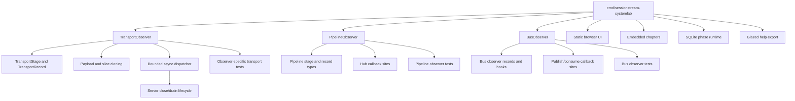

# Systemlab Removal and Sessionstream Simplification Plan

## Executive summary

Sessionstream currently ships a browser-based teaching and validation application under `cmd/sessionstream-systemlab`. It contains 53 files and approximately 7,830 lines of Go, Markdown, JavaScript, HTML, and CSS. It also drives Makefile targets, CI smoke tests, documentation export, README sections, reference documentation, browser heartbeat examples, and three diagnostic observer APIs.

The goal of SESSIONSTREAM-006 is not merely to delete one command directory. It is to remove Systemlab and then remove every supporting abstraction that lacks an independent retained consumer, while preserving the reusable Sessionstream substrate and the WebSocket lifecycle behavior required by downstream applications such as rag-ttc.

The work must proceed through an evidence-led deletion graph. `TransportObserver`, `PipelineObserver`, and `BusObserver` currently have Systemlab as their only non-test in-repository consumer, but they are exported public APIs and may have external users. `ErrorObserver` is separate from Systemlab and participates in runtime error reporting; it must be audited independently rather than removed by association. Application-level protobuf ping/pong behavior is also independently required for browser-compatible heartbeat and must remain even if the Systemlab browser helper is deleted.

The expected result is a smaller repository with fewer public observer types, fewer callback sites, less cloning, less WebSocket shutdown state, fewer tests coupled to diagnostics, no Systemlab frontend or phase runtime, and simpler build and publication workflows. The exact public API deletion set remains an audit result, not a premise.

## 1. Scope

### In scope

- Delete `cmd/sessionstream-systemlab`.
- Remove Systemlab-specific Makefile targets and binary defaults.
- Remove CI and documentation-publish commands that execute Systemlab.
- Remove Systemlab README and root/reference documentation links.
- Audit and potentially remove `TransportObserver`, `PipelineObserver`, and `BusObserver`.
- Audit `ErrorObserver` separately.
- Remove observer record types, stage enums, cloning helpers, dispatcher lifecycle, dropped counters, options, callback sites, and tests if their observer API is deleted.
- Remove dependencies made unreachable by the deletion.
- Preserve or replace independently valuable protocol examples and fixtures.
- Validate public API, dependency, source-line, binary, and CI simplification.

### Out of scope

- Redesign the Sessionstream event, projection, hydration, replay, or WebSocket protocols.
- Remove application-level heartbeat ping/pong required by browser clients.
- Remove lifecycle APIs required by rag-ttc.
- Introduce a generic asynchronous dispatcher without a retained consumer.
- Add compatibility shims for APIs explicitly approved for removal.
- Preserve Systemlab behavior through another framework or location.
- Change downstream product semantics.

## 2. Current footprint

### 2.1 Direct Systemlab footprint

Observed on the SESSIONSTREAM-006 branch:

```text
Directory: cmd/sessionstream-systemlab
Files: 53
Go files: 26
Text source/documentation lines: approximately 7,830
Disk footprint: approximately 384 KiB
```

The directory contains:

- Cobra command entrypoint and server command;
- HTTP routing and JSON APIs;
- six embedded textbook chapters;
- phase 1–5 runtime implementations;
- phase-specific actions, checks, projections, clones, and rendering;
- SQLite persistence and restart exercises;
- WebSocket server instances and browser clients;
- trace assembly and observer adapters;
- static HTML, partials, CSS, and JavaScript;
- tests and generated logging metadata.

### 2.2 Repository wiring

Systemlab is referenced by:

| Location | Current responsibility | Removal action |
|---|---|---|
| `Makefile` | `BINARY`, `systemlab-build`, `systemlab-run` | Remove or replace binary default and targets. |
| `.github/workflows/push.yml` | Smoke-test Systemlab help | Remove job step; retain other smoke evidence. |
| `.github/workflows/publish-docs.yaml` | Export Glazed help through Systemlab | Decide whether to delete docs publication or move export to a retained command. |
| `.goreleaser.yaml` | Build/release binary if configured | Audit and remove Systemlab artifact. |
| `README.md` | Architecture tree, run commands, chapter links, browser pong reference | Remove and replace only independently necessary protocol guidance. |
| `pkg/doc/reference/01-reference.md` | Systemlab command and Make targets | Remove obsolete command documentation. |
| logcopter generation | Generated package metadata | Regenerate after deletion. |
| Go module graph | CLI/help/static dependencies | Run `go mod tidy` and explain each removed module. |

### 2.3 Observer consumers

Current non-test in-repository call sites are:

```text
BusObserver:
  cmd/sessionstream-systemlab/phase2_runtime.go

PipelineObserver:
  cmd/sessionstream-systemlab/phase4_lab.go

TransportObserver:
  cmd/sessionstream-systemlab/phase3_lab.go
  cmd/sessionstream-systemlab/phase4_lab.go
  cmd/sessionstream-systemlab/phase5_runtime.go
  cmd/sessionstream-systemlab/ws_observer.go
```

Tests also consume the APIs. Test use proves behavior, not product demand. Removing an API permits removal or rewriting of tests whose only purpose is that API.

### 2.4 Diagnostic API inventory

| API | File | Systemlab use | Independent runtime role |
|---|---|---:|---|
| `BusObserver` | `pkg/sessionstream/bus.go` | Yes | Optional publish/consume diagnostics. |
| `PipelineObserver` | `pkg/sessionstream/pipeline_observer.go` | Yes | Optional projection/hydration/fanout diagnostics. |
| `TransportObserver` | `pkg/sessionstream/transport/ws/observer.go` | Yes | Optional WebSocket stage diagnostics. |
| `ErrorObserver` | `pkg/sessionstream/hub.go` | No direct Systemlab evidence in current inventory | Runtime error reporting alongside optional `ErrorStore`. |

The first three are candidates for deletion. `ErrorObserver` requires a separate decision because it represents error reporting rather than teaching-trace instrumentation.

## 3. Dependency graph



Deletion must follow edges from consumers to support code. Removing support code before its consumers obscures what is independently required. Keeping support code after all consumers disappear preserves unjustified surface.

## 4. Retained core boundary

The target repository should retain:

- typed commands and canonical events;
- Hub routing and projection execution;
- event and hydration stores;
- replay and projection cursors;
- UI fanout interfaces;
- WebSocket snapshot-before-live delivery;
- one-reader/one-writer ownership;
- ordered request processing;
- timed heartbeat failure detection after PR #11;
- application-level protobuf ping/pong;
- public lifecycle and close semantics used downstream;
- focused examples that demonstrate product-relevant integration, if approved.

The target should not retain code solely to render phase-by-phase teaching traces.

## 5. Observer deletion analysis

### 5.1 Transport observer

Deleting `TransportObserver` can remove:

- `TransportObserver`, `TransportObserverFunc`, and `WithTransportObserver`;
- `TransportStage`, `FrameDirection`, and `TransportRecord` if no other use remains;
- timeline entity summary and record-construction helpers;
- record and payload cloning done only for observer retention;
- dozens of `s.observe` call sites;
- bounded observer queue and dispatcher goroutine introduced in PR #11;
- observer queue capacity, dropped counter, close/drain state, context detachment, and panic recovery;
- observer-specific tests for sequence, queue overflow, blocked callbacks, panic, context lifetime, and records;
- Systemlab WebSocket trace adapter.

The deletion must not remove actual protocol error handling merely because it currently emits an observer record. Close, return, and frame behavior remain authoritative.

### 5.2 Pipeline observer

Deleting `PipelineObserver` can remove:

- pipeline stage/mode/record types;
- observer interface, function adapter, hooks, and Hub option;
- record cloning and projection summaries used only by diagnostics;
- callbacks around event append, view load, UI projection, timeline projection, store apply, cursor advance, rebuild, and fanout;
- Systemlab phase 4 trace projection;
- observer-specific tests.

Each callback site must be inspected to ensure it does not accidentally perform non-observer state changes.

### 5.3 Bus observer

Deleting `BusObserver` can remove:

- interface and hook adapter;
- `BusRecord` fields used only for diagnostics;
- `WithBusObserver` option;
- publish and consume callbacks;
- Systemlab phase 2 ordering trace support;
- observer-only bus tests.

Bus message mutation and topic behavior are separate features and must not be removed by association.

### 5.4 Error observer

`ErrorObserver` is not a Systemlab downstream dependency in the current evidence. It works with `ErrorRecord`, `ErrorStore`, and Hub failure reporting. The ticket must answer:

1. Is `ErrorObserver` used by known downstream applications?
2. Does `ErrorStore` provide sufficient durable error evidence without it?
3. Do tests use it to assert error propagation that should instead be asserted through returned errors or stores?
4. Is synchronous callback behavior acceptable?
5. Is removal a breaking API change justified by simplification?

No deletion decision is made until those questions are answered.

## 6. Public API policy

The observer types are exported. In-repository usage is insufficient to establish external usage. Before deletion:

1. Search all local go-go-golems workspaces and module caches for imports and symbols.
2. Search GitHub code where access permits.
3. Inspect released documentation and examples.
4. Determine whether Sessionstream follows semantic-version compatibility guarantees before v1.
5. Record the intended release note and migration statement.

If removal is approved, do not retain deprecated no-op observers. A no-op compatibility layer preserves type and option surface while removing its stated behavior, which is worse than an explicit breaking change.

## 7. Browser heartbeat preservation

The root README currently points to:

```text
cmd/sessionstream-systemlab/static/js/websocket.js
```

as the shared browser helper that echoes application-level ping nonces. Removing Systemlab deletes that file, but not the protocol requirement.

Choose one retained representation:

- a minimal browser client example under `examples/`;
- a concise JavaScript snippet in durable protocol documentation;
- a transport conformance fixture used by tests;
- generated client behavior if a generated browser SDK exists.

The replacement must preserve:

```json
{"ping":{"nonce":"opaque"}}
{"pong":{"nonce":"opaque"}}
```

Do not remove `PingFrame`, `PongFrame`, server heartbeat, or browser compatibility because the teaching UI disappears.

## 8. Documentation publication

`.github/workflows/publish-docs.yaml` exports help through the Systemlab binary. The audit must determine whether the published help content is independently valuable.

Options:

1. Delete the publication workflow and obsolete help pages.
2. Move retained help export to a smaller existing command.
3. Add a documentation-only exporter if publication is a real product requirement.

Option 3 should be rejected unless a consumer is identified. Recreating a command solely to preserve an unconsumed pipeline would defeat the simplification goal.

## 9. Proposed phases

### Phase 0: Merge prerequisite heartbeat work

PR #11 contains the final heartbeat supervisor and observer dispatcher behavior. Merge or rebase SESSIONSTREAM-006 onto it before implementation so deletion is measured against the actual intended main branch.

Acceptance:

```text
SESSIONSTREAM-006 base contains PR #10 and PR #11.
Working tree is clean.
Baseline CI and race tests pass.
```

### Phase 1: Freeze inventory and retained contracts

- Capture file, line, binary, dependency, public API, and test counts.
- Enumerate every Systemlab reference.
- Search local and GitHub downstream observer usage.
- Record the retained core API and browser heartbeat fixture.
- Decide ErrorObserver separately.

Acceptance:

```text
Every deletion candidate has an evidence row and disposition.
```

### Phase 2: Remove direct Systemlab application

- Delete `cmd/sessionstream-systemlab`.
- Remove Makefile build/run targets and binary defaults.
- Remove CI smoke execution.
- Remove or migrate docs export.
- Remove README and reference links.
- Remove GoReleaser artifact configuration.
- Regenerate metadata and tidy modules.

Acceptance:

```text
rg finds no executable or documentation reference to sessionstream-systemlab,
except historical ticket documents intentionally retained.
```

### Phase 3: Remove orphan observer APIs

For each of Bus, Pipeline, and Transport:

1. Confirm no retained non-test consumer.
2. Delete public types and options.
3. Delete callback sites and record construction.
4. Delete observer-only cloning and summaries.
5. Delete or rewrite tests.
6. Run focused and full validation before moving to the next observer.

Acceptance:

```text
No observer symbol survives without an approved retained consumer.
No protocol or state mutation was removed with a callback.
```

### Phase 4: Simplify WebSocket lifecycle

If `TransportObserver` is removed:

- remove observer dispatcher fields from `Server`;
- remove queue, stop, stopped, closing, drops, mutex, and Once;
- remove observer start/stop/wait integration;
- simplify `Server.Close` while preserving connection worker waiting;
- remove context-detachment and record-cloning code that becomes dead;
- retain heartbeat and request lifecycle workers.

Acceptance:

```text
Server.Close still supports deadline and repeated-call semantics.
Full race tests pass.
```

### Phase 5: Dependency and documentation cleanup

- Run `go mod tidy`.
- Explain every dependency removed or retained.
- Remove orphan generated files.
- Update README architecture and examples.
- Update release configuration.
- Update API and migration documentation.

### Phase 6: Completion audit

Run:

```bash
make ci-check
GOWORK=off go test ./... -count=1
GOWORK=off go test -race ./... -count=1
GOWORK=off go vet ./...
govulncheck ./...
lefthook run pre-push
```

Also validate:

- standalone `GOWORK=off` mode;
- intended workspace mode;
- GoReleaser snapshot;
- no stale Systemlab references;
- public API diff;
- source/line/dependency reduction;
- downstream rag-ttc compile against the resulting release candidate.

## 10. Expected simplification evidence

Record before and after:

| Metric | Baseline | Target |
|---|---:|---:|
| Systemlab files | 53 | 0 |
| Systemlab text lines | ~7,830 | 0 |
| Systemlab binary artifacts | 1 | 0 |
| Systemlab Make targets | 2 | 0 |
| Systemlab CI commands | At least 2 | 0 |
| Observer APIs | 4 | Audit result |
| WebSocket observer lifecycle fields | 7 on PR #11 | 0 if TransportObserver removed |
| Transport observer call sites | Audit count | 0 if removed |
| Observer-only tests | Audit count | 0 or rewritten |
| Go module dependencies | Baseline graph | Reduced graph with explanation |

Line-count reduction is evidence, not the objective. The objective is fewer concepts and lifecycle interactions while retaining required behavior.

## 11. Decision records

### Decision: Delete before abstracting

- **Context:** Transport observer delivery could be extracted into a generic dispatcher, but Systemlab is its only demonstrated non-test consumer.
- **Options considered:** Generalize dispatcher; extract concrete unit; leave embedded; remove observer and dispatcher.
- **Decision:** Complete the consumer and API audit before any dispatcher extraction. If no retained consumer exists, delete the observer subsystem.
- **Rationale:** Abstraction preserves implementation and maintenance cost. Deletion removes both.
- **Consequences:** The generic dispatcher design remains in the Architecture Garden, not production, unless another retained consumer justifies it.
- **Status:** accepted

### Decision: Treat observer APIs independently

- **Context:** Sessionstream has Bus, Pipeline, Transport, and Error observers with different semantics.
- **Options considered:** Remove all observers together; keep all; classify each by retained consumer and contract.
- **Decision:** Audit and decide each API independently.
- **Rationale:** Error reporting may remain valuable even when teaching traces disappear.
- **Consequences:** Deletion may occur in several focused commits.
- **Status:** accepted

### Decision: Preserve heartbeat protocol

- **Context:** The only shipped browser pong helper lives under Systemlab, but browser-compatible heartbeat is required independently.
- **Options considered:** Remove ping/pong with Systemlab; preserve schema and replace example; retain entire helper directory.
- **Decision:** Preserve protocol and move only the minimal browser/conformance evidence if needed.
- **Rationale:** Consumer deletion does not invalidate transport semantics.
- **Consequences:** README and tests require a new durable reference.
- **Status:** accepted

### Decision: No compatibility no-ops by default

- **Context:** Exported observer APIs may be removed.
- **Options considered:** Keep no-op types/options; deprecate indefinitely; make an explicit breaking removal.
- **Decision:** If removal is approved, delete APIs and document the break rather than retaining behaviorless shims.
- **Rationale:** No-op diagnostics silently violate caller expectations and preserve conceptual surface.
- **Consequences:** Release notes and downstream migration may be required.
- **Status:** proposed pending downstream audit

## 12. Risks

### External observer consumers

The repository cannot prove that exported APIs have no external users. Mitigate with local workspace search, GitHub search, release-note review, and explicit versioning decision.

### Removing tests that cover real behavior

Observer tests may incidentally exercise heartbeat, hydration, fanout, close, or panic behavior. Replace their protocol assertions before deleting observer-specific assertions.

### Documentation workflow failure

Systemlab is currently a help exporter. Removing it without changing `.github/workflows/publish-docs.yaml` will break CI or publication.

### Browser heartbeat regression

Deleting the only JavaScript nonce-echo implementation without replacement can leave downstream browser teams without a conformance example.

### Branch ancestry

The ticket branch begins at merged PR #10 while PR #11 is still open. Rebase or merge main after PR #11 lands before implementation.

### Historical documents

Ticket documents and Architecture Garden notes may retain Systemlab references intentionally. Automated `rg` acceptance checks must distinguish historical evidence from live code and user-facing documentation.

## 13. Open questions

1. Are Bus, Pipeline, or Transport observers used in Pinocchio, rag-ttc, CoinVault, or other local workspaces?
2. Is `ErrorObserver` independently required, or can returned errors plus `ErrorStore` replace it?
3. Should help publication be removed entirely or moved to another retained command?
4. Which browser heartbeat example should replace the Systemlab helper reference?
5. Does GoReleaser currently publish only Systemlab, and if so, does Sessionstream need any binary release after deletion?
6. Which dependencies disappear after `go mod tidy`?
7. Should examples/chatdemo remain, be reduced, or become the minimal integration reference?
8. What semantic version communicates exported observer removal?

## 14. Review checklist

- [ ] Branch contains PR #11 before implementation.
- [ ] Full downstream observer search is recorded.
- [ ] ErrorObserver has an independent decision.
- [ ] Browser heartbeat remains documented and tested.
- [ ] Systemlab directory is gone.
- [ ] Build, release, CI, and docs wiring are clean.
- [ ] No no-op observer shims remain.
- [ ] Observer-only lifecycle state is gone where approved.
- [ ] Protocol tests replace incidental observer coverage.
- [ ] Full test, race, lint, vet, vulnerability, and release validation pass.
- [ ] rag-ttc compiles against the release candidate.
- [ ] Before/after simplification metrics are recorded.

## 15. References

- `cmd/sessionstream-systemlab/`
- `Makefile`
- `.github/workflows/push.yml`
- `.github/workflows/publish-docs.yaml`
- `.goreleaser.yaml`
- `README.md`
- `pkg/doc/reference/01-reference.md`
- `pkg/sessionstream/bus.go`
- `pkg/sessionstream/pipeline_observer.go`
- `pkg/sessionstream/hub.go`
- `pkg/sessionstream/transport/ws/observer.go`
- `pkg/sessionstream/transport/ws/server.go`
- `pkg/sessionstream/transport/ws/server_test.go`
- `/home/manuel/code/wesen/go-go-golems/go-go-parc/Projects/2026/08/11/PROJECT REPORT - Bounded Asynchronous Observer Dispatch - Contracts Lifecycle and Generic Go Design.md`
- `/home/manuel/code/wesen/go-go-golems/go-go-parc/Research/Software Architecture Garden/sessionstream/designs/01 - Bounded Asynchronous Observer Dispatcher.md`
